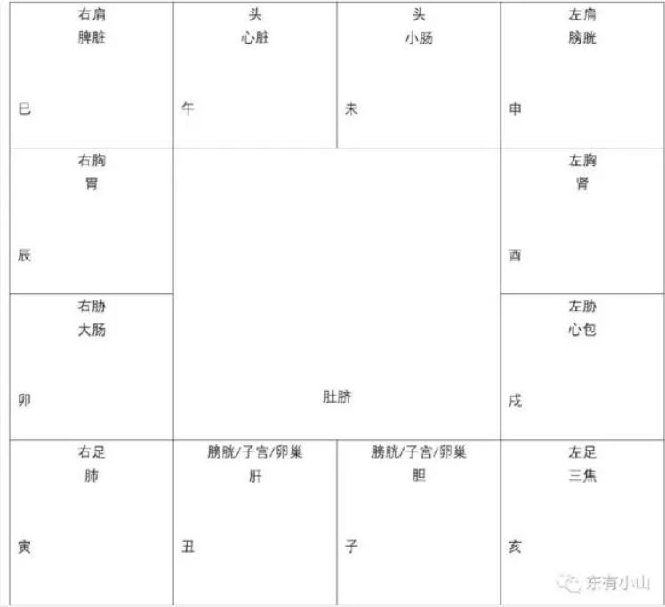

疾厄宫反映的是一个人的疾病情况，特别是致命伤和重疾。像感冒这一类疾病，就不在考虑范围之内了。
中医的《内经》当中有个歌诀：肺寅大卯胃辰宫，脾巳心午小未中。膀申肾酉心包戌，亥焦子胆丑肝通。
这个歌诀实际是将十二地支和我们的脏腑器官对应起来，即：
子- 胆
丑- 肝
寅- 肺
卯- 大肠
辰- 胃
巳- 脾脏
午- 心脏
未- 小肠
申- 膀胱
酉- 肾
戍- 心包
亥- 三焦
如果疾厄宫位于十二地支中的哪一个当中，或者其他哪一个十二地支宫位的具体情况特别不好，那这个人就需要注意对应部分的脏腑问题。
除此之外，一个人的疾病情况还要看他命盘的具体星辰分布:

如果某个宫位的具体情况不好，那么就说明对应的身体部位容易发生疾病。
也表示一个人的情绪表达方式，一个人的内在心态。

疾厄宫所主，为疾病与灾厄。但关于灾厄之有无，疾厄宫其实只能加以参考。因为由命宫的星系组台对灾厄加以推断，常常比利用疾厄宫星系还要直接，但对于疾病的观察，则宜将命宫星系与疾厄宫星系并重，如廉贞七杀，一般主呼吸器官病，若疾厄宫见者，当然有这种意义，但若疾厄寓见恶曜，而命宫为廉贞七杀，则亦主呼吸器官有病。

有时甚至要将命宫星系与疾厄寓星系联合来推断一种疾病。如疾厄宫见廉贞七杀，而有煞会照，命宫见红鸾天喜，根据笔者的研究，便何发哮喘的可能。或暂时不发作，至大限流年命宫见红鸾天喜，再有流煞冲会，然后始告发病。

宜活用，不可拘泥。有时应将命宫星曜与疾厄宫三方四正所会星曜同时参看，甚至要将大限及流年的[流曜]联合起来推断，然后才可以推断准确。（例如鼻咽癌的发病，其主要星系仍为廉贞七杀，行运至天同与巨门相对的宫限，若大限煞忌并照，且见龙池与命宫同度或对照，而廉贞七杀又会合火铃或天刑者，则该大限则为发病之期。）

由斗数推断疾厄，不可专视星盘疾厄宫，应该将逐个大限的疾厄宫加以观察，然后始能推定其人一生的主要疾病。有时还要再查流年的疾厄宫，然后才能看到病情的发展。这是推断疾病的重要技巧，读者须加注意。

1.于推算疾厄宫时，尤应注意【打破十二宫的界限】，若只据原局的疾厄宫来推算，则虽可推出体质上的一些基本特征，但却容易忽略大运及流年的疾厄克应。
    （1）故欲视其人一生的重要病患，有无开刀动手术，有无危症，便应将星盘作通盘观察，不论居于原局任何宫垣，只需找出一组[病星]便应立刻加以注意。
    然后看此组[病星]在那一个大运、那一个流年，受煞忌刑耗等曜冲会，且落于大运或流年的疾厄宫、命宫、福德宫，则均可视为克应之期。

    （2）视疾厄，必须兼视疾厄、命宫、福德三宫。疾厄宫固无论矣，命宫星曜组合，为当局者的命运特征，故亦可用来推断病患，尤其应用来推断生死安危。至于福德宫，所主者为誊舂神享受，及物质享受，有些病患，固影响物质享用，尤影响精神享受者，如失眠、性无能等，则往往于福德宫克应。

2.斗数推算疾厄，能于未发病前，即可知其酝酿疾病之期。并从而知发病之期。故可藉此加以趋避。若能事前善于摄生，及依疾病的性质加以事前调治，则可避免病发。并非由于星盘有此组星系，便非发此等疾病不可。若认为如此，便陷于宿命认的泥沼，非研究斗数者所宜，学者于此当加以注意。倘持宿命观点，则不如不算，反而心安理得。

3.斗数推算疾病，主要根据五行阴阳。
    1.五行生克及五脏六腑的知识：
        心属火，小肠亦属火，火亦为循环系统、及神经系统，于五官则为舌。
        肝属木，胆亦属木，木亦为内分泌系统，于五官则为眼。
        脾属土，胃亦属土，土亦为消化系统，于五官则为口。
        肺属金，大肠亦属金，金亦为呼吸系统，于五官则为鼻。
        肾属水，膀胱亦属水，水亦为排泄及生殖系统，于五宫则为耳。

    根据这些五行所属，固然可知疾患之所在，如见武曲在疾厄宫，有煞曜，因武曲属阴金，主阴金受损，所以其病在肺或大肠；但因金克木的缘故，若武曲会合的星曜太强，如得会化禄、化权、化科及诸吉，则金盛伤木，可能得肝胆病或眼病，因此亦有两目发黄、肝炎等疾。倘如命宫见煞刑忌曜者，尤可据此推定。

    根据五行相克的原则，可以知道一些由星曜观察疾病的基本规律：
        火受水克，水太强，则主心与小肠、循环系统及神绎系统、或舌头口腔生病。
        木受金克，金太强，则主肝胆、内分泌系统、或眼目有病。
        土受木克，木太强，则主脾胃、消化系统、或口腔食道有病。
        金受火克，火太强，则主肺及大肠、呼吸系统、或鼻腔、气管有病。
        水受土克，土太强，则主肾及膀胱、排泄系统、或耳腔、外耳有病。
    
    除此以外，又有[母慈减子]的说法。如火太盛，火虽可生土，但生之太过则反生土病，所以据此又可订定一些原则。
        火受木生，受生太过则火病，如心病之类。
        木受水生，受生太过则木病，如肝病之类。
        土受火生，受生太过则土病，如胃病之类。
        金受土生，受生太过则金病，如肺病之类。
        水受金生，受生太过则水病，如肾病之类。
    
    由此可见凭星曜推断疾病，非常之困难，的确需要一些经验。但一个总的原则却是，见疾厄宫星曜先详其五行阴阳，如金弱，先怀疑是金病；如金强，则应怀疑是其所克的木有病；如金星林立，则应怀疑是水病。