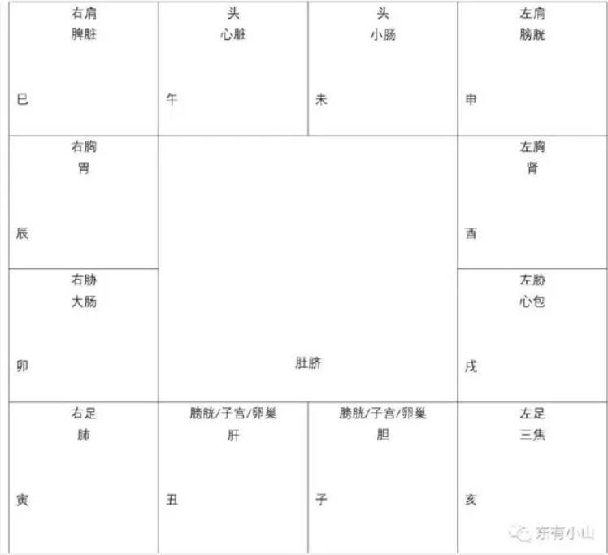

疾厄宫反映的是一个人的疾病情况，特别是致命伤和重疾。像感冒这一类疾病，就不在考虑范围之内了。
中医的《内经》当中有个歌诀：肺寅大卯胃辰宫，脾巳心午小未中。膀申肾酉心包戌，亥焦子胆丑肝通。
这个歌诀实际是将十二地支和我们的脏腑器官对应起来，即：
子- 胆
丑- 肝
寅- 肺
卯- 大肠
辰- 胃
巳- 脾脏
午- 心脏
未- 小肠
申- 膀胱
酉- 肾
戍- 心包
亥- 三焦
如果疾厄宫位于十二地支中的哪一个当中，或者其他哪一个十二地支宫位的具体情况特别不好，那这个人就需要注意对应部分的脏腑问题。
除此之外，一个人的疾病情况还要看他命盘的具体星辰分布:

如果某个宫位的具体情况不好，那么就说明对应的身体部位容易发生疾病。
也表示一个人的情绪表达方式，一个人的内在心态。

1.于推算疾厄宫时，尤应注意【打破十二宫的界限】，若只据原局的疾厄宫来推算，则虽可推出体质上的一些基本特征，但却容易忽略大运及流年的疾厄克应。
    （1）故欲视其人一生的重要病患，有无开刀动手术，有无危症，便应将星盘作通盘观察，不论居于原局任何宫垣，只需找出一组[病星]便应立刻加以注意。
    然后看此组[病星]在那一个大运、那一个流年，受煞忌刑耗等曜冲会，且落于大运或流年的疾厄宫、命宫、福德宫，则均可视为克应之期。

    （2）视疾厄，必须兼视疾厄、命宫、福德三宫。疾厄宫固无论矣，命宫星曜组合，为当局者的命运特征，故亦可用来推断病患，尤其应用来推断生死安危。至于福德宫，所主者为誊舂神享受，及物质享受，有些病患，固影响物质享用，尤影响精神享受者，如失眠、性无能等，则往往于福德宫克应。

2.斗数推算疾厄，能于未发病前，即可知其酝酿疾病之期。并从而知发病之期。故可藉此加以趋避。若能事前善于摄生，及依疾病的性质加以事前调治，则可避免病发。并非由于星盘有此组星系，便非发此等疾病不可。若认为如此，便陷于宿命认的泥沼，非研究斗数者所宜，学者于此当加以注意。倘持宿命观点，则不如不算，反而心安理得。

3.斗数推算疾病，主要根据五行。