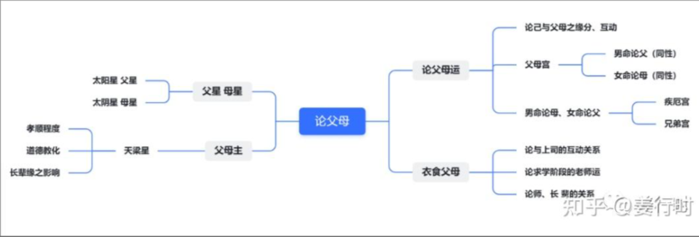

a.先学习每颗星本身的特质与性情；
b.然后想象每颗星的特性与哪些星曜可以组合或相斥；
c.分析星曜组合的差异；
d.带入全盘的组合变化。

解盘时，一定要看整体，全盘分析，比如当我们要分析命造父母情况时，绝不能只看父母宫，可参考下图：

学习斗数看似不简单，星曜太多很繁琐，知识点更多不易记，其实若有系统的学习，组合理解记忆，就会越来越轻松。记住最核心的要点，很多事物就可以联想出来，解盘时脑海里才会有“画面感”，所以阿姜介绍星曜时经常会为大家整理思维导图以及最最核心要点，先记住最靠近中心的一圈，再慢慢扩大，就可以自然而然的取象了。