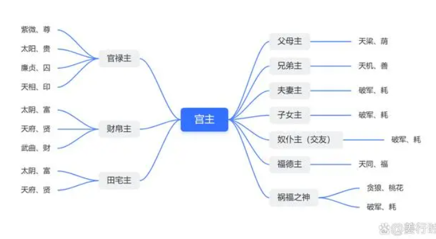

宫主是冥冥中的力量，有点像守护神，又有点像潜意识，简单些，也可以理解为是这个宫的主人。

**官禄主**
紫薇（尊）太阳（贵）廉贞（囚）天相（印）

**财帛主**
太阴（富）天府（贤）武曲（财）

**田宅主**
太阴（富）天府（贤）

**父母主**
天梁（荫）

**兄弟主**
天机（善）

**夫妻主**
破军（耗）

**子女主**
破军（耗）

**交友主**
破军（耗）

**福德主**
天同（福）

**祸福之神**
贪狼（桃花）破军（耗）

**用法**
1.当宫主星落入所主宫位内，它的力量会大大的加强。
（比如：当紫微、廉贞、太阳、天相这四颗星坐入官禄宫的时候，更利于你的事业表现。而且，官禄主也有当官、当领导的含义，所以这几颗星在官禄宫，也更容易做官、做领导。这四颗官禄主也是有区别的，紫微倾向于指导、正职管理、提出方案；廉贞倾向于联络同事、联络上下级、并且执行方案；太阳倾向于“为人民服务”、宣传类、扩大知名度；天相倾向于协助管理、盖章、调解纠纷、处理问题等等。

同样，当武曲、天府、太阴落入财帛宫的时候，那就对赚钱非常有利，但最好是遇到吉星吉化，不要有煞星化忌的破坏。如果吉星吉化多，大运又吉利，财帛主是能让你发财的。但是，你的成就有多大，会到什么样的程度，还是需要看命宫三方四正整体组合以及大运走势决定。）

2.当宫位为空宫时，宫主星用法
一般某个宫位为空宫时，表示该方向不确定性大，或者命造对该宫易不重视或有淡化、不在乎的现象。但是若命盘的命宫、身宫所坐之主星刚好是空宫的宫主星，反倒有对该宫很重视或在乎的情形。

解释：
***为什么没有疾厄宫、迁移宫和命宫***
因为疾厄宫、迁移宫和命宫的宫主是你自己(疾厄宫是你的身体，就归你管；你本人想出去就出去，不想出去就可以不出去，所以迁移宫也归你管。)

***为什么有这么多的官禄主、财帛主？破军星却要身兼多职?***
因为在紫微斗数中主事业官禄和主财富的主星比较多，紫微、太阳、廉贞、天相四颗星都是官带星，也都为官禄主，武曲、天府、太阴三颗星都和财富格局强相关，就都为财帛主。