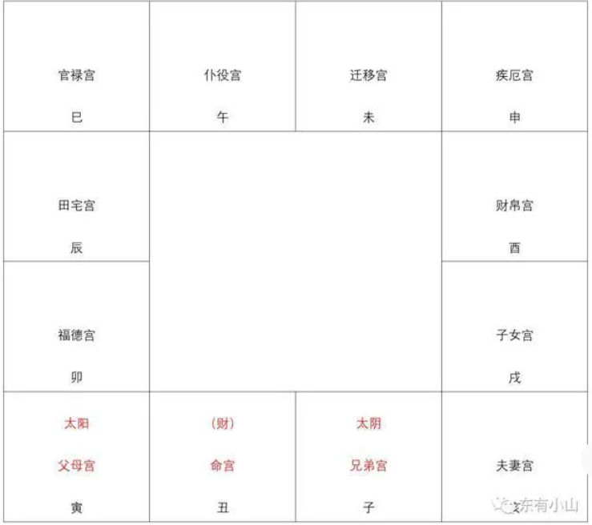
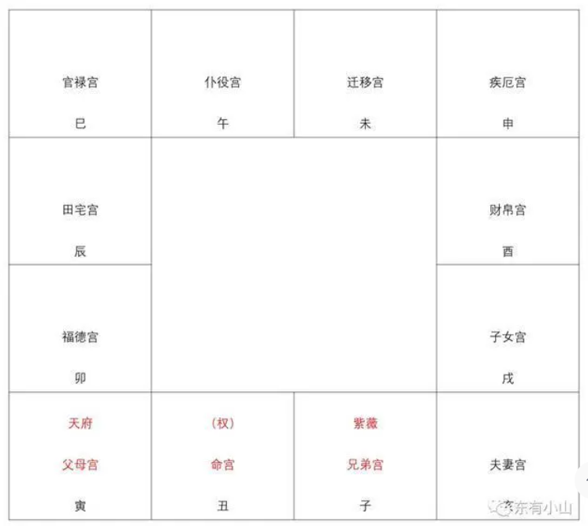
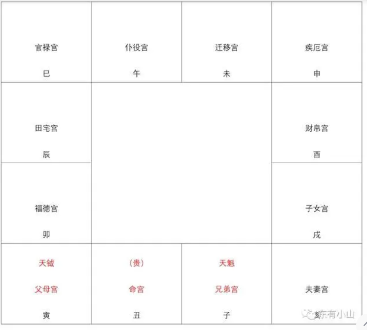
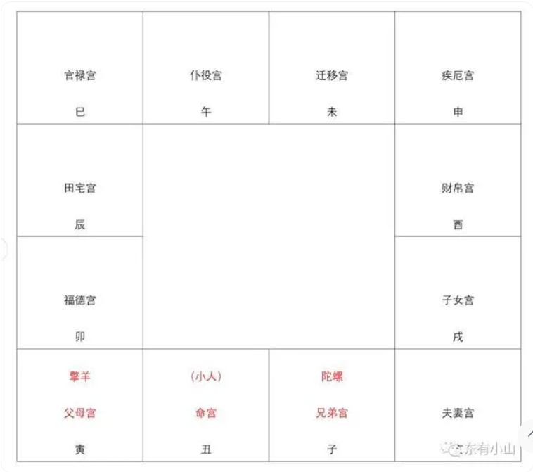

1.第一种是身有祖业的格局，一般来说命宫里是财星的人，或者父母宫是财星，或者田宅宫有财星，这些都是身有祖业的格局，也就是家庭财务情况比较好的格局。

2.第二种格局叫做日月夹财,在命盘中，如果太阳和太阴分别位于命宫左右的父母宫和兄弟宫，就像太阳太阴把命宫夹住一样，那么这种人一世的财禄很大，包括先天的和后天的财禄，甚至即使命宫里面没有什么财星也没有关系。

3.第三种格局叫做紫府夹权,紫府夹权是指命宫的旁边分别是紫微星和天府星，就像把命宫夹住一样，这种格局的命主一般都会掌权。

4.第四种格局叫做魁钺夹贵,魁钺夹贵是指天魁和天钺分别位于命宫的左右，像把命宫夹住一样，这种格局的命主有贵气，至于是因为有钱还是有权而有贵气，要看具体情况。

5.第五种格局叫做羊陀夹杀,羊陀夹杀是指命宫旁边刚好是擎羊和陀螺，就像它们两把命宫夹住一样，这种格局的人最容易被人影响，所以很容易遇到小人。这种格局的命主，命里注定小人很多，所以要学会如何分辨小人，具体的方法是头脑中要有一个观念：只有真理才是对的，所以父母说的不一定对，朋友说的不一定对，老师说的也不一定对，别人说的并不代表真理，谁说父母说的、朋友说的、老师说的以及其他人说的就一定对呢，所以要有探索求真的心理和批判思考的能力。