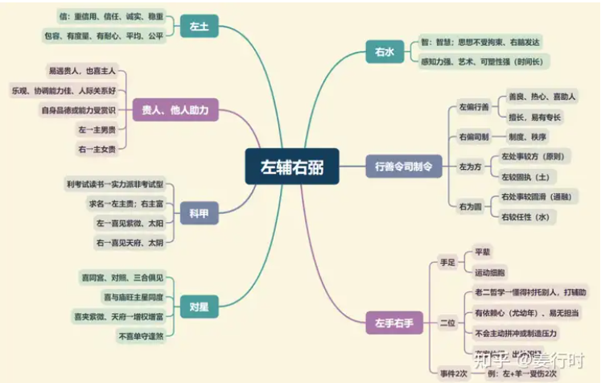

**核心要点**
1.左辅右弼均化气为“助力”，性质相近，若要严格区分，可依五行属性说明：

左辅星属阳土，随和大方，秉性宽厚，有包容性

右弼星属阴水，细腻体贴，温婉圆融，有亲和性

2.左辅右弼就像是皇帝身边之左右丞相，命宫有左辅右弼任何一颗星，就代表本人圆融干练，懂得沟通协调，个性温和，自然容易与人交往，可得朋友之助力。因此适合从事需要“团队精神”的工作，自然顺境较多，不至于孤军奋战，倍感艰辛了。

3.左辅右弼代表着同学、同事、朋友之间的友谊及助力；左辅右弼双星入兄弟宫或子女宫、奴仆宫有“增加数量”的现象，仅见其一则不是，如见左不见右。

4.左辅右弼均见（同度、夹或会照）有实力派的特性；也有“协调、平衡”的功能，例如七杀、破军见左右双星，可增加其稳定性，再见“禄星”主掌权。

5.左辅右弼有左右手的功能，是做别人的左右手还是别人做自己的左右手？要看同度主星。

一般中天星（紫微、太阳、太阴）与南斗王（天府）多属别人做自己的左右手，有天生领导特质；而“佐帝之星”多属做别人的左右手，之后才有一片天。

**左辅右弼古文**
1.“左右夹命为贵格”，一般左辅右弼仅夹未宫及丑宫，夹的是什么主星差异很大，古文所说的是夹“紫微破军”主贵，其次是紫微破军三合俱见左辅右弼，也主贵。

2.“左右单守照命宫，离宗庶出”，古文是指：（1）命宫为空宫（无主星）；（2）左辅单守命宫不见右弼，或右弼单守命宫不见左辅；（3）命宫见火星铃星，尤其父母宫又有凶星坐守；又或反之，父母宫空宫左辅单守（不见右弼），见火铃。“离宗庶出”是指离开父母（过继）或偏房所生的人，现代社会较少见这种情形。

3.“左右贞羊遭刑盗”，左辅右弼不喜与擎羊、廉贞星同度，会照次之，主“遭刑盗”，遭刑或遭盗。

遭刑→遭遇诉讼（刑法）或血光之灾（刑伤）

遭盗→遭遇盗匪或家中遭盗窃

所以廉贞星不喜见左右再遇擎羊，若又再见天刑、化忌，则情形更加严重。

**左辅右弼入十二宫**

***命宫***
喜助人、乐观、稳重，形貌敦厚，喜逢紫微太阳太阴→多为长子长女（或独子女）且成就高。单守逢煞→易有两重父母或异胞兄弟。

***兄弟宫***
逢吉→数目增加，尤其左右俱见；关系良好，有助力；逢煞→帮倒忙。

***夫妻宫***
感情之表达及处理能力良好，有“多情”之倾向，也可以说感情比较丰富，喜成双成对出现→良缘；单守再逢桃花星→可能有外宠（自己或配偶），或配偶易酒色财气。

***子女宫***
与子女缘分良好，亲密，子女聪明、乐观。

***财帛宫***
表财源稳定，且易有投资或额外之财（兼职）；逢煞→易损失2笔财或耗损后的额外开销。

***疾厄宫***
左辅属土主脾、胃；右弼属水主肾脏、膀胱、血液。

***迁移宫***
朋友多，人际关系良好，动中得富贵。

***交友宫***
逢吉→朋友多；逢煞→多损友或扯后腿

***官禄宫***
行政处理能力强，可发挥群策群力，有沟通斡旋之才干。逢吉→可得要职，尤其主星庙旺同度且为财官星。

***田宅宫***
财田星庙旺逢吉→易有两间房子或有租金收入，另主易有迁出或有人寄居。

***福德宫***
精神稳定，易自我调适；逢凶→易多操烦。

***父母宫***
与父母关系和谐，缘分良好；若与紫微日月同度→父母多为长子（女）且成就不低。逢煞→辛劳有成；与父母易聚少离多。