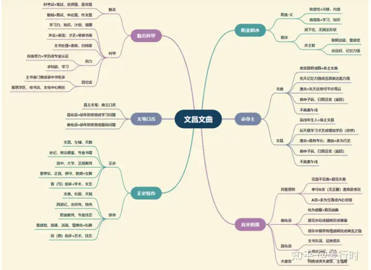

**核心要点**
文昌：阳金，化气“科甲”，司文为能文之士。
文曲：阴水，化气“科甲”，司文为舌辩之士。

1.文昌文曲皆化气为“科甲”，所以代表聪明机变，反应快，学习能力强，能够现学现卖。

2.昌曲会使人看起来有才气，风度翩翩，俊雅清秀。

3.喜欢文学、艺术、大众传播文化等等。

4.文昌属阳金，较潇洒，偏向于文章辞藻之表现；文曲属阴水，较风流倜傥，偏向于表演艺术、演说等与口才有关之表现，能言善道。

5.文昌利于功名，有文学、考试方面的才华；文曲则有音乐、舞蹈等艺术方面的才华。

6.昌曲夹则兼有两者的属性，只是从外表看不出来。

**文昌文曲古文解读**

1.“昌曲巳亥临，不贵即大富”

文昌属金，文曲属水，喜坐守“巳酉丑”及“申子辰”，因巳酉丑合为金，申子辰合为水，为庙旺之位。这六个宫位能将文昌文曲的优点凸显出来，喜读书或长相清秀。
其实，古文这句话有几个问题没说清楚。
一是古代极重科甲，然而现今社会仅主学习能力强，反应快，能言善道。
二是文昌文曲巳亥临，正好形成两星俱见，成双成对，所以昌曲星的优势能发挥出来。
三是仍须与有力主星及性质相近的星曜同度，才能发挥功能，否则易有过于表面化的情况。

2.“昌曲夹命最为奇”

这也是古人重科甲的格局模式，认为“昌曲夹命”如同“昌曲同度”坐命宫一般，能有“科甲”的表现。
前面说过，“吉星夹”是环境来影响自己（被动），而非自己意愿（主动）。所以，夹积极的主星时，效果较为明显，例如官禄主（求官，主贵）、财帛主（求财，主富）。但有一个要注意的事，文昌文曲是“学习、才华、才艺、资讯”的星曜，所以当事者若不愿学习，仅主“外表斯文”，易有“虚而不实”的现象。最不喜夹桃花星，易有感情困扰。

3.“昌曲破军逢，刑克多劳碌”
“文昌贪狼，政事颠倒。昌贪居命，粉身碎骨”
“文曲巨门多丧志”
这几句正好说明“遇吉未必是吉”，斗数与八字不同之处在于斗数虽论“五行生克”，却也强调星性特质，所以多了个视野，但也多了矛盾。破军、贪狼、巨门都有水的特性，文昌属金水，本应相生，但是由于其星性本身的特质，又会产生矛盾。
破军星为“耗”，有“冲锋陷阵”“打前锋”的武将个性，遇到文昌文曲（科甲星，主才华、文学），反倒有“秀才遇到兵，有理说不清”的冲突现象，好处是让破军有文学素养，坏处是让破军不敢“放手一搏”。
贪狼星为“桃花”，有“爱美（表面）”的特性，遇昌曲虽可增加其才华、才艺的学习与发挥，但也容易让“爱美”的特性增强，会过于重视“表现、表面”及“情欲发挥”，而忽略实力与现实的真实，常会让自己陷于“进退两难”。
巨门为水星，主“暗、是非”，遇昌曲会增强发言的机会或言词的犀利，其次因为昌曲为“才艺、才华”，尤文曲也是水星，会增强巨门水的情感疑惑（“暗”的阴暗面），容易丧志或晚节不保。
以上组合均不喜“昌曲化忌”或主星化忌为忌星，容易形成古文所言的凶象组合，若再遇煞星更是。
“文昌贪狼，政事颠倒”，是指贪狼与文昌（文曲亦是）同度，易有“正事不做”或“为反对而反对”的特性。其实也可说容易因其他事物或兴趣分心，或喜凸显与别人不同之处，
“昌贪居命，粉身碎骨”，是指廉贞贪狼落陷巳亥宫，与文昌文曲同度，且昌曲化忌（或廉贞贪狼化忌），主易有意外（尤其从高空跌落或摔下），或情感上易有极端的行为或决裂。

4.“文昌武曲，为人多学多能”

“文昌武曲于身命，文武兼备”
这里是以武曲星为主，说明文武兼备的特性。武曲星属金，有执行力、行动力强的特性（七杀也是），有武将的特性，只是武曲的“金”有内敛性，就会比破军更冷静。此时遇昌曲虽可增长其才华，但也易引起情感上或学习上的矛盾，因为增强了“学习、分析”的特性，会使武曲“刚直”的个性产生犹疑，易“优柔寡断”。若再见左辅右弼（实力派）双星，则昌曲“优柔寡断”反倒降低，真正成为“文武兼备”的特质。

5.“铃昌陀武，限至投河”

这是斗数中一个凶的格局。是否真的会“投河”？其实不尽然。须先天命盘上的命宫、身宫、福德宫有此特性才会。其次“铃昌陀武格”也可解读从事“危险性高”的工作。
此格局的主要条件是“铃星、文昌、陀罗、武曲”等星其一坐守命宫，再见其他三星相聚，其中以此四星分别坐守“辰戌”两宫为主格，其他组合为偏格（凶性较轻）。
先天命宫有“铃昌陀武格”组合的人，待人处事比较容易“看起来”深思熟虑，“做起来”却轻率或短虑。

**文昌文曲入十二宫**

***命宫***
昌→内敛、喜学习；曲→活泼，喜辩论；昌曲具见仪表似高学历者

***兄弟宫***
兄弟中有学历高或文学艺术爱好者，甚至从业者；逢吉→感情融洽，能互相帮助

***夫妻宫***
欣赏有内涵、文质彬彬的异性；主情趣

***子女宫***
聪明、学习力好，子女易习才艺

***财帛宫***
主有价证券或文具、书籍、刊物，易花钱在证券或书籍刊物上

***疾厄宫***
昌→耳；曲→齿；亦主皮肤（外表）→昌主痣；曲主斑

***迁移宫***
喜外出去有情调或文艺之处

***交友宫***
喜结交风流俊雅之士

***官禄宫***
易为内勤或行政工作，擅长分类、编排、归档和做表格；逢吉→可为专业人士或文教类

***田宅宫***
逢吉→主书香门第或居住在学区附近，也包含书店、文化中心等；逢凶→表面风光

***福德宫***
兴趣广泛，有智慧，博学多才，也主风花雪月，也舍得在这一方面投资

***父母宫***
父母才识不低，博学多才