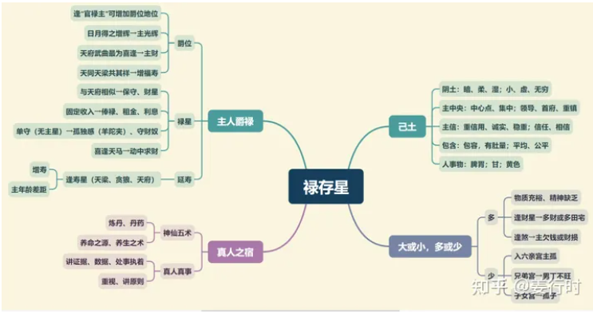
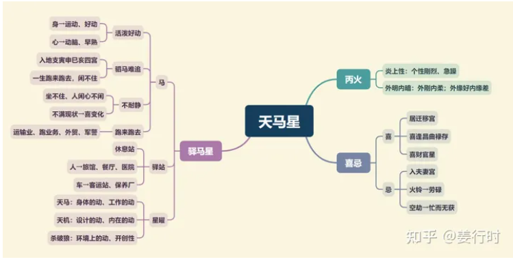

**禄存星**

阴土，化气爵禄，司贵寿

1.禄存星前有擎羊，后有陀罗夹制，个性拘谨小心，放不开；有主星庙旺同宫，可减轻羊陀夹制的影响，主行事稳重，不急不徐；若主星陷弱，或无主星禄存单守，容易感觉受制于人，闷闷的，压力很大（羊陀夹）。

2.古文说：“禄存守于田财，堆金积玉”，禄存为财星，喜坐守田宅宫、财帛宫，尤其喜欢与财帛主（天府、太阴、武曲）、田宅主（太阴、天府）同度于财帛宫、田宅宫，主财旺或不动产（产业）兴旺，不见空星更佳。

3.“双禄重逢，终身富贵”，此句的双禄是指禄存与化禄，而重逢则有两个层面的含义，一是说两星“相遇”，另一是说本命盘的禄存与化禄，与运限的流运禄存及流运化禄“相逢”。

先天盘（先天命宫）若有禄存与化禄相会或对照，则为财旺的根基（尤其与财帛主、田宅主同度）。行运再逢流运禄存及流运化禄“相逢”，多为发迹之时。

阿姜一般会将禄存星解读成“大财”或“固定财”，而将化禄星解读成“小财”或“流动财”。两星相会，则形成“大小通吃（大财小财都赚）”或“钱滚钱（以财生财）”的现象。

4.“禄逢冲破，吉处藏凶”，禄存星遇煞（对宫有煞）来冲破，即形成“吉中带凶”的组合，也可解读成“表面好看，实际却有问题”。禄存星主财最不喜地空地劫，其次是火星铃星。

**禄存星入十二宫**

***命宫***
有主星→稳重、保守；禄存单守→过度谨慎、守财奴；紫微日月同度、又见左右→易为长子长女。

***兄弟宫***
男丁不旺→易有兄弟1人，姊妹多的情况；逢吉→有助力，但缘薄；逢煞→易因兄弟或友失财。

***夫妻宫***
有主星同度→男得妻财或女配良缘，若主星强旺，感情稳定；逢吉→有助力，但少情调；逢煞→易因配偶失财或配偶自私。单守→感情孤独或易受欺负。

***子女宫***
男丁不旺→子息1人、有女儿；逢吉→对子女寄望高，物质充裕；逢煞→易无儿子或子女耗财。禄存单守→男丁单，子女不多。

***财帛宫***
生财谨慎小心，不易有太多风险发生，在稳定中进财。喜与官财田主同度或三合→财旺、可投资或创业；逢吉→有财，或从事金融业、财会；逢煞→易投资失利或借贷度日。禄存单守→守财奴。

***疾厄宫***
逢吉→一生少病；需防肺、脾胃之疾。

***迁移宫***
与人相处小心翼翼，懂得保护自己，不容易推心置腹。逢吉→远方求财，或远方信用好（跨国企业）；逢凶→反之。

***交友宫***
逢吉→喜结交有财务能力之友，喜友来访欢聚；逢凶→友易周转。

***官禄宫***
责任心强，行事多拘小节，工作的稳定度高，不会随便换工作，若主星陷弱，在工作上就会显得处处受掣肘，充满无力感。逢吉→喜见财官星，主事业可掌权或升迁多；逢凶→多辛劳。

***田宅宫***
重实用，多能置产；逢吉→可得祖业，可投资不动产或证券或长期获利；逢凶→易不守或不易置产；单守→易与左右邻舍不合。

***福德宫***
理财谨慎，懂得节流之道，另外在精神上有钻牛角尖倾向，不容易放得开悠闲度日。逢吉→一生不愁吃穿；喜赚钱或投资；逢凶→易辛劳得财。

***父母宫***
与紫微日月、左右相逢→长子女；逢吉→父母经济中上，感情单调或己与父母缘薄；逢凶→父母多劳碌或因父母失财。

**天马星**

1.天马星组合（八马）
禄存+天马为折鞭马，主动中得财，如跑业务、销售
紫微+天马为扶舆马，主动中成事、出外遇贵
太阳+天马为雄马，主动中求名、出外成事
太阴+天马为雌马，动中求财、跨国企业
火星+天马为战马，主冲动勇猛、横发横破
陀罗+天马为折足马，主拖延阻碍、行动不便
擎羊+天马为负尸马，主易见刑伤、挫败、车祸
空亡+天马为亡马，主为求温饱东奔西跑（“空亡”详见下文）

2.禄马最喜交驰，禄存星为“固定之财”，与天马星同度，则有“动中生财”之意，也有“钱滚钱”之意，所以人要动或财要动，才会有财。此组合称为“禄马交驰格”。

禄存星主静，天马星主动，若见禄存而不见天马，则财不动，仅主固定之财，如薪资、利息所得。若见天马而不见禄，则人奔波劳碌而所获不多（同时也要参考是否有其他财星，若有则不然）。所以，两者同度可增长其优势→财源滚滚、辛劳有成，其中以同度力量最为明显，对照为次，三合更次。尤喜禄存与主星同度（财帛主、官禄主更佳），若禄存单守则古书说“若独坐命，而无吉化，乃看财奴耳”。

3.“马遇空亡，终身奔走”，此处所言是指天马星遇“空亡”星，一般“空亡”大多指截空与旬空。而空星（地空地劫、截空、旬空）之中，尤以地空地劫的破坏力较强，且“空星”一般有“飘渺、飘荡”“财务耗损、时空耗损”之意。因此，古书说“与空亡同宫，谓死马亡马”，即是说明“此马无力”或“产能不高”→终身奔走，可延伸为奔波劳碌、所获有限，或其工作性质为“东奔西走”，例如：船员、计程车司机、货运运输。

**天马星入十二宫**

***命宫***
好动、活泼、早熟；有庙旺主星同度或居迁移宫→出国机会多或从事东奔西跑的行业。

***兄弟宫***
兄弟不常在家或早年离乡背井；逢吉→有助力，但缘薄；逢煞→各奔东西不往来。

***夫妻宫***
配偶易为远方人士或异族；主变化或配偶喜户外活动，或从事驿马性质行业。逢吉→不宜早婚，聚少离多；逢煞→易有变化，或不满现状。

***子女宫***
主子女好动活泼，有运动细胞。逢吉→聚少离多，但出外常回来；逢煞→易见刑伤或出外回来很少

***财帛宫***
动中（劳动或动脑）生财→喜见财星、禄存，主辛劳有成。逢煞→易日夜奔波或借贷度日。

***疾厄宫***
主过度疲劳或操劳，也主生殖器疾病，主生活饮食不正常。

***迁移宫***
好动，喜外出。逢吉→人缘好，出外机会多；逢凶→反之、易受伤或失物。

***交友宫***
主变动，喜交八方的朋友，或友多分散外地各方。

***官禄宫***
主变动或从事劳动、运动、业务、运输或外贸等行业。逢凶→多辛劳。

***田宅宫***
逢吉→可远方置产；另主喜搬动家具或喜变换房屋内的布置。逢凶→不宜远方置产，另主家中通道或逃生通道易堆积杂物。

***福德宫***
逢吉→劳心、出游机会多；逢凶→易劳心又劳力。

***父母宫***
父母易离乡背井或一生劳碌闲不住；逢吉→辛劳有成；与父母聚少离多；逢煞→父母辛劳，或其一长年在外（分居）。