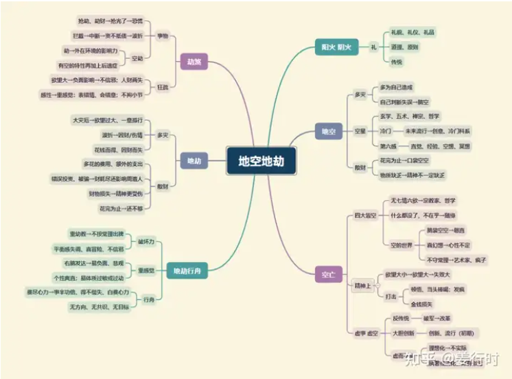

**核心要点**
地空：阴火，化气空亡，主多灾
地劫：阳火，化气劫杀，主破失

大家都知道空劫不好，究竟怎么不好，是不是全无优点，这些问题可能就不是很清楚了。今天我们试着从心理特征角度来描述空劫，希望大家可以体会。

1.空劫星虽然都属火，但是并不积极。

2.空劫星可以说是理想主义者，追求完美，凭直觉、感觉行事，不易与现实妥协。

3.空劫星原创性很强，喜欢天马行空、胡思乱想，想象力、创造力强。

4.不会火星铃星、擎羊陀罗，常想的多做的少。

5.地空星化气为空亡，表“空性”，本就一无所有，一无所执，不在乎。

6.地劫星化气为劫杀，表“得失”，得而复失，不停的追求，不停的放弃。

7.空劫星喜欢探讨人生之究竟，对心理学、哲学、宗教、命理有兴趣。

**文昌文曲古文解读**
1.“劫空夹命为败局”

地空地劫星的特质与“时间、空间、感情、金钱”有关，因此，“空劫夹命”或“空劫夹身”一般主易有财务损失、感情失落、时间空间管控不良等等之事。其中，空劫最大的杀伤力是“劫财”与“劫情”。所以古文说，“石崇富豪，限行地劫以亡家”，“项羽英雄，限至地空而丧国”。
另外，地空地劫为“成双成对”的星曜，所以除了“空劫夹”为败局外，也不喜欢空劫同宫或对照，其破坏力较强，地空地劫三合相会，力量稍轻。

2.“地空守命，为人做事虚空，地劫守命，为人做事疏狂”

地空星一般虽主耗损（感情、钱财），但多偏向于“精神”或“抽象（虚虚实实）”之事；而地劫星的耗损（感情、钱财），则多偏向于“实物”或悔恨之事。
其实虚空与疏狂往往也是艺术家的特质，因此空劫就优点来说，有创意、天马行空；若以缺点来说，易不踏实，似有似无。
另外空劫有“飘荡”特性，古文说，“劫空独守，飘流孤苦以终身”， 所以空劫不宜再见动荡星或变曜星，会增加其动荡性。

3.“生逢地空，犹如半空折翅，命中遇劫，恰如浪里行舟”

“半天折翼”是说鸟在天上，飞到一半翅膀被折断；“浪里行舟”可解释船在海面行走遇到“惊涛骇浪”或"无方向感"。
空劫也有破军星的“耗损”与“改革”的特性，但却比破军星多了中断（半天折翼）、无后勤支援（浪里行舟）。
地空星的破坏性多属“自我想法（精神、飘渺）”或“内在因素”造成，而地劫星则多属“无法掌控（环境变数）”或“外在因素”。
地空喜擎羊或火星同度，再见吉星相拱，可以有技艺或创意的发展空间。地空也喜欢与七杀星（金）以及太阴星（水）同度，可增加创意能力，七杀多主工业创意，太阴多主艺术创意。

4.“劫空临禄马，称之禄倒马倒”

指禄存天马与地空地劫同度或会照。
地空地劫有“飘荡”及“损耗”特性，所以遇天马星，主增加天马的波动性与飘荡性；而遇禄存星，则会使禄存的财有耗损，或“奔波后始得财”，就现今社会而言，算是“无经济效应”的赚钱方式，或辛劳得财，另外也主“寅吃卯粮”之意。
此句古文和结合“禄逢冲破，吉处藏凶”一起理解。

**文昌文曲入十二宫**

***命宫***
不拘小节、思想天马行空，不喜太繁杂的习俗或细节；易好动或体质过敏。

***兄弟宫***
易见夭折或聚少离多（尤其地劫）；不宜金钱往来。

***夫妻宫***
欣赏异性非常注重“感觉”，没有感觉任凭金山银矿也无法打动心扉，“跟着感觉走”，所以容易因对方某个特质而迷恋不已，更易因另一个特质而无法忍受，于是就天人交战痛苦不已。另主，恋爱时易时空不配合，家世差异大；婚后易聚少离多或财务争执。

***子女宫***
子女活泼好动或体质过敏；易先损后得或女多男少。

***财帛宫***
空劫入财帛宫易不在乎钱财，在乎感觉，财来财去或买空卖空，反而可以从事创意、创作等思考性的工作而进财，如设计、写作、作曲等等。

***疾厄宫***
忌生冷食物及暴饮暴食；主生活饮食不正常，烫伤、烧伤、中毒、热湿疹。

***迁移宫***
与人交往凭“感觉”，气味不同就是无缘，不会因利害关系而勉强自己；也主出外波折多或耗财，或主出外开创、创新。需防摔伤或跌落。

***交友宫***
与朋友不宜有金钱往来。

***官禄宫***
喜欢工作的内容有创意性、变化性，如果是属重复性的工作就很容易感到单调不满而萌生去意，此时再会火星铃星就易离去；波折多，主创意、哲学、宗教、艺术、工业。

***田宅宫***
祖业不易守或得，也主空旷、空房；另主家宅财运会经历一次大波折。

***福德宫***
空主哲学或宗教，劫主心烦；非常注重精神生活，花再多的钱都不吝惜。

***父母宫***
主父母辛劳，财运起伏大，或因投机或经商损财；另主父母需注意意外事件或突发疾病。