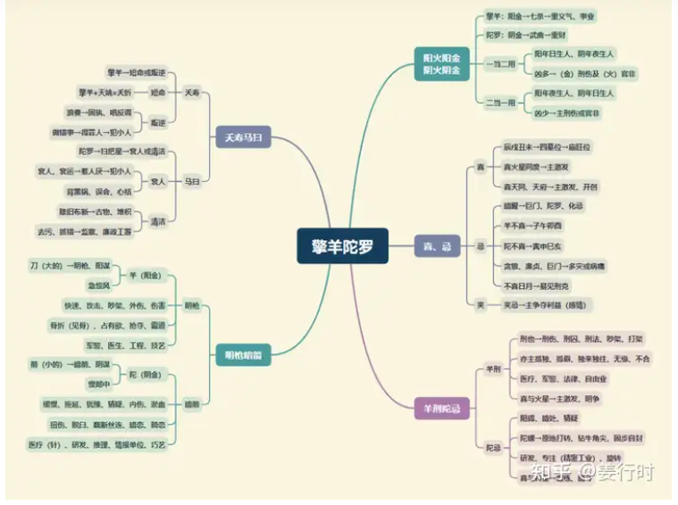

**核心要点**
擎羊：阳金（火），化气刑，主刑伤。

陀罗：阴金（火），化气忌，主是非。

1.擎羊陀罗五行属金，象征刚毅、果决、恒心、毅力、持续性，能够贯彻始终、有头有尾、学得专业技能。

2.从负面来看，有任性、固执、暴力之性质，易于记恨、报复，君子报仇十年不晚。

3.擎羊属阳金，又有火之性质，所以较刚烈，一般而言，较“酷”，“强悍”，有个性。

4.陀罗属阴金，做事略迟疑，但一旦下定决心就容易钻牛角尖，表面不虚张声势，而暗中埋头苦干。

5.适合从事精密技术或需要有毅力体力的工作。

**文昌文曲古文解读**
1.“擎羊入庙，富贵声扬。阳火同宫，威权出众。”

此处说明擎羊居庙旺位时，虽为煞星，也可有一番成就。但需再逢一些吉星或禄权科方成格，至于成就大小，则以何主星同坐守或会照论之。
“羊火同宫，威权出众”是指擎羊与火星同居庙旺之位，主“威权出众”，若两星其一为落陷，则不是。此组合主擎羊阳金遭火星阳火提炼，所以会有一段“锻炼”时刻，若能熬过，之后必有一番成就，一般主“武职大利”。武职在现代社会多属军警、医疗、科技工业，也可主厨师或炼钢之相关行业（带火又带金的行业）。

2.“巨火擎羊，终身缢死”，“擎火廉贞巨门同，伤残暗疾且招刑”

前文说明擎羊火星喜庙旺同度或相会，但现在这两句古文说的却是个例：巨门星与廉贞星不喜同时见到擎羊火星，即使均为庙旺，仍有凶煞现象发生。
一般主疾病、官非或意外，建议从事“危险性高”的工作，例如医疗人员，因廉贞主血。

3.“贪遇羊陀居亥子，名为泛水桃花”，“贪狼陀罗在寅宫，号曰风流彩杖”

这两句古文透露了贪狼星不喜擎羊、陀罗。贪狼化气为桃花，是一个欲望特质的星曜，而这个欲望是为了满足情欲还是物欲，要看副星星曜的会照，其次是看福德宫（想法、品德）的结构。
“泛水桃花格”大多主人聪明、易激进、欲望重、易因“酒色财气”惹祸。
“风流彩杖格”是说贪狼居寅坐命宫与陀罗同宫，此即为乙年生人，福德宫必有紫微天相与擎羊同度，主人聪明有才艺或技艺，但易为情所困（陀罗有拖延、困惑、迷惑、原地打转等特性），若福德宫又无吉星同度，更为“孤君”特质，易一意孤行或产生矛盾，因为主掌个性的命宫坐陀罗即主拖延，主掌想法品德的福德宫坐擎羊即主激进、冲拼，因此容易形成矛盾组合。

**文昌文曲入十二宫**

***命宫***
擎羊→个性刚直、行动快速、刀子口而得罪人。陀罗→优柔寡断、固执、拖延。

***兄弟宫***
不易合作；幼年易见争吵或聚少离多。

***夫妻宫***
欣赏独立、有个性之异性，在感情处理方面，擎羊敢爱敢恨，不会拖泥带水；陀罗较死心眼。

***子女宫***
子女个性刚强、易受伤或体弱，主叛逆性强；另主易有体罚或暴力的教养方式。女命→产运易不顺或小产，或早产。

***财帛宫***
适合以专业技术为生，主辛劳得财或喜投机。擎羊→有钱必花，尤其是大财；陀罗→易耗暗财或花小积多。

***疾厄宫***
主血光、骨折、扭伤、肠，也主虫咬。擎羊→羊癫疯、精神分裂；陀罗→慢性病、牙、酸痛、癣。

***迁移宫***
出外不顺或交通意外多。羊主开快车，陀主注意力分散。

***交友宫***
损友多或军警、五术、医疗之友多。

***官禄宫***
擎羊做事干净利落、有魄力、有耐心；陀罗有执着性，但不干脆。擎羊→敬业不乐业；陀罗→喜摸鱼或杂事一堆。

***田宅宫***
易不守或不易得祖业；另主折旧快或产权问题，不宜预售屋。羊→外观易损毁；陀→宅内杂乱。

***福德宫***
易见刑伤或官非。羊（陀坐命）→想得快，做的慢；陀（羊居官）→易错失良机、心结。

***父母宫***
不合或聚少离多；见日月→易见刑克。