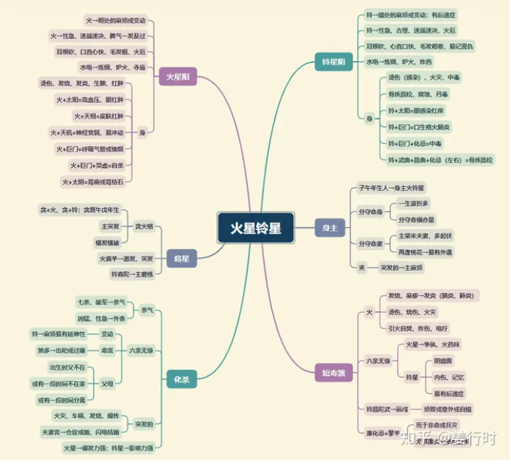

**核心要点**
火星：阳火，化气为杀，主性刚。

铃星：阴火，化气为杀，主性烈。

1.火是物质燃烧之现象，会发出光和热，如火之燎原迅速无比，但又辉光不久，当成为灰烬时，火亦消失无踪，因此火星铃星有热情、积极、主动、开创、活泼、懂得表现之性质。

2.负面上，火星铃星就脾气火爆、不耐静、虎头蛇尾三分钟热度、令人无法招架。

3.火星铃星只要不遇擎羊陀罗，发完脾气就算了，当然做起事就不适合需要耐心的工作。

4.火星属阳火，较刚暴猛烈，像狂风暴雨一般倾泻而下。

5.铃星属阴火，较缓和持续，如小雨不停打在头上，发发牢骚就算了。

6.火铃在福德宫，人不容易安逸，总是有一大堆念头、点子在脑子里窜来窜去，如遇到天机化忌，就会有神经衰弱之倾向。

7.命带火星铃星，容易是劳碌命，闲不住。

8.带火星铃星，讲话速度、行走步伐都会加快。

**文昌文曲古文解读**
1.“火铃夹命为败局”

“火铃夹”一般仅在“寅午戌”年生人才有此组合。
南派是依“年支”排列，所以只有“火铃夹寅宫”一种机会。“中州派（或其他派别）”是依年支加生时顺转排列，所以各个宫位都有机会形成“火铃夹”。
火星、铃星的特性有“突发”与“蔓延”（火灾、病毒），当火铃夹身命宫时，即易遇“突发事故”或事件“蔓延速度加快”，常让当事者措手不及，其中仅以火铃夹贪狼星为吉，其他为凶。

2.“火铃旺宫亦为福”

火铃星庙旺相遇，主“武职大利”，这主要是说火星、铃星居庙旺之地的优势，能将火星铃星的优点得以发展，所以需再见一些吉星、禄星相会，更主发越，仍是“武职大利”。在现今社会“科技研发”“能源发电”也与火铃有关联性，此组合尤其喜欢“魁钺、昌曲”等科甲星相逢，更主专业技能或有“武职官贵”，也喜“龙池凤阁”主巧艺。

3.“羊火同宫，威权出众”

指擎羊与火星同居庙旺之位，主“威权出众”，若两星其一为落陷，则不是。此组合主擎羊阳金遭火星阳火提炼，所以会有一段“锻炼”时刻，若能熬过，之后必有一番成就，一般主“武职大利”。武职在现代社会多属军警、医疗、科技工业，也可主厨师或炼钢之相关行业（带火又带金的行业）。

4.“巨火擎羊，终身缢死”，“擎火廉贞巨门同，伤残暗疾且招刑”

前文说明擎羊火星喜庙旺同度或相会，但现在这两句古文说的却是个例：巨门星与廉贞星不喜同时见到擎羊火星，即使均为庙旺，仍有凶煞现象发生。
一般主疾病、官非或意外，建议从事“危险性高”的工作，例如医疗人员，因廉贞主血。

5.“铃昌陀武，限至投河”

这是斗数中一个凶的格局。是否真的会“投河”？其实不尽然。须先天命盘上，命宫、身宫、福德宫有此特性才会。其次“铃昌陀武格”也可解读从事“危险性高”的工作。
此格局的主要条件是“铃星、文昌、陀罗、武曲”等星其一坐守命宫，再见其他三星相聚，其中以此四星分别坐守“辰戌”两宫为主格，其他组合为偏格（凶性较轻）。
先天命宫有“铃昌陀武格”组合的人，待人处事比较容易“看起来”深思熟虑，“做起来”却轻率或短虑。

6.“火铃同宫共擎羊，廉贞七杀阵中亡”

指“廉贞七杀”与火铃星同度见擎羊；或者廉贞与火铃星同度，再见七杀、擎羊相会。不论组合是前者或后者，都不宜再见化忌、煞星来相会，主易有意外或血光之灾、或自我毁灭的可能性。

**文昌文曲入十二宫**

***命宫***
个性急躁，声音低沉或沙哑，毛发易粗（铃为卷发）。

***兄弟宫***
聚少离多，尤其铃星。

***夫妻宫***
欣赏活泼外向之异性，容易热恋，也容易一时心急而发生口角争执，进而冲动性地分离；另主配偶性急；易有闪电（仓促）结婚之象。庙旺位→不刑克，但有不合；铃+桃花+左或右（单一）→配偶易有外遇；身宫坐夫妻宫→自己也会。

***子女宫***
子女性急，注意力不易集中。

***财帛宫***
求财心态积极，会认真赚钱，星曜组合不佳时容易投机、赚不义之财；喜贪狼同度主突然成富。

***疾厄宫***
主发烧、发炎、烫伤、烧伤、中毒、热湿疹；忌生冷食物。

***迁移宫***
在外表现活泼积极，铃星还有幽默感，懂得如何成为众人瞩目之焦点（爱表现），难免也会因为心直口快而影响人际关系。

***交友宫***
火主仆（朋友）怨；铃主出卖、陷害、侵吞。

***官禄宫***
处事积极，不拖泥带水，恨不得赶快把事情做完，闲不住，适合从事动态性之工作。

***田宅宫***
家中温度燥热或闷湿，六亲个性急躁，皮肤稍差。亦主火厄→尤其逢巨门、廉贞；再逢擎羊、天刑→诉讼。铃星→另主偷窃或产权纠纷。

***福德宫***
支配钱财大方，又“痛”又“快”，手边不能有现金，很容易花掉，当然在投资理财方面，会因追求短期获利而走上短线，若主星稳定（如紫微、天府）则尚好。

***父母宫***
不宜见左右单星或桃花星→易为偏房所生或两重父母。