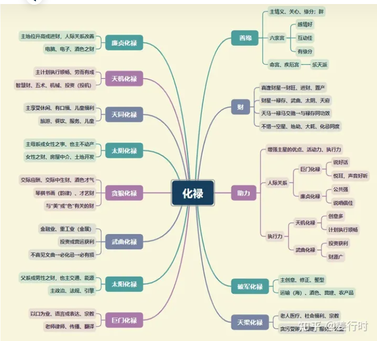
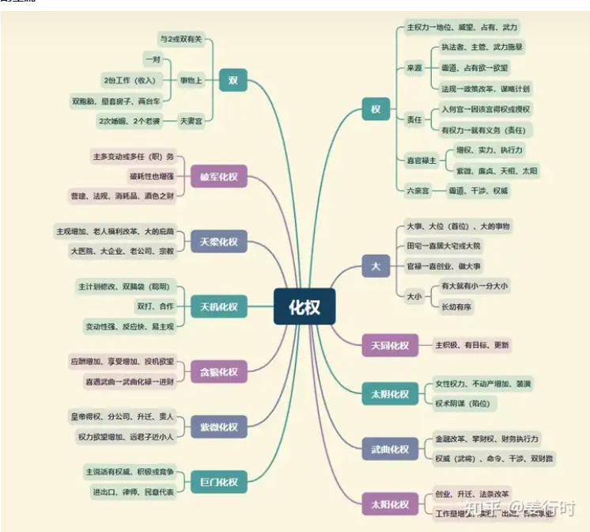
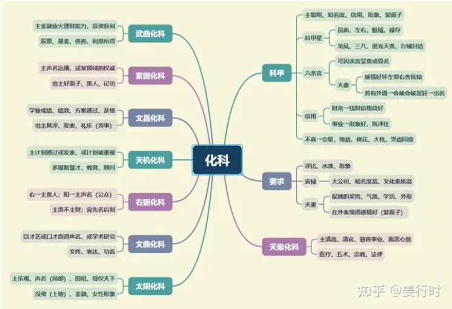
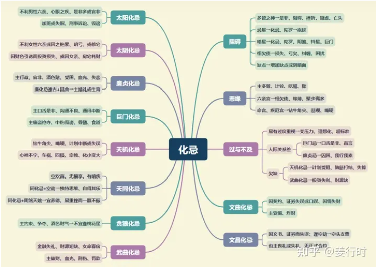

四化星重点提示：
1.化禄→主财，善缘，助力
2.化权→主权力、双或2或更多、强硬
3.化科→主科甲、声名、要求
4.化忌→主阻碍、恶缘、过与不及

**一、四化星含义**
四化星并非独立的星曜，它是由年干排列，依附在某些固定的星曜上，且依化禄、化权、化科、化忌的属性，对所依附的星曜产生变化，转为积极或消极，或者转为正向或负向。

以天机为例，天机化气为善，主筹，而化禄主善缘、助力。当天机化禄之时，可增强天机的分析力，筹划力，但却未必增强天机的魄力，因为天机属乙木，本身不具备魄力属性。当天机化权之时，因化权有“权力、责任、大的”特性，可增强天机的魄力（因责任或权力而有魄力）。若天机化科，因化科有“科甲、聪明、要求、形象、信用”等特性，因此可增强天机的气质、知名度, 且更有“想的多（分析），手做的少”的特性（分析师、顾问）。天机化忌则有思想或分析受“阻碍、是非、过度执着”而造成“失算、神经质、想不开” 等现象。

所以，化禄有增加星曜的“优点、顺畅”特性，化权可增强星曜的“积极、魄力”，化科能强化星曜的“见地、形象、知名度”，化忌则为缺点、阻碍、相欠债的表现，详见思维导图。

古人重视科举，很多现象多以官贵来注解。
禄权对照（分别在对宫），多主财运旺——双与财。
权科对照，多主实至名归——实权与名声。
科禄对照，多主先名后利或名利双收——名声与财。

化禄喜居财帛宫，再见财星（财帛主，禄存）更佳。
化权喜居命、财、官三宫， 若为对照，主出外有成就，有权力。权坐命为实，权照命易有虚权。
化科喜坐官禄或命宫，主见解独特或有名气，若居财帛，多钱财主信用，或先名后利，喜见天魁天钺（贵人星），主受人赏识或重用，昌曲也好。
化忌坐命身宫，易有是非，或操心劳力、自寻烦恼。

**四化星古文解读**

1.“科禄权会守身命，出将入相”
“科权禄合，富贵双全”
这两句古文是说禄权科三星分布于本宫与三合，其次是本宫与对宫相照，产生极大的效应—— “财、权、名”均见。

一般来说，财帛主或财帛宫喜见化禄，主财旺。官禄主或官禄宫喜见化权，主实权、领导。化科也喜见官禄主或官禄宫，主声名、见地。实际上，则不一定要拘泥于这些条件，只要禄权科分坐命宫、财帛、官禄，彼此相会相助，即可产生助力。

2.“化禄禄存夹身命，不贵则富”

“化权化科夹身命，富贵声扬。科权禄夹，为贵格”
若以禄存、化禄为成双成对的对星来论，则“禄存化禄夹命”则可论及“不富则贵”。然而其中最符合的一个组合是“贪狼居午”坐命，丙年生人，逢禄存居巳，化禄居未来夹——马头带剑格。
“科权夹”或“禄权夹”，或“科禄夹”，都与富或贵有关。然而“禄权科”同度的主星也影响富贵的大小。

3.“化科独嫌地空旬空，遇则虚名”

“科文陷于凶乡，苗而不秀”
化科星（或科甲星）不喜落陷之地，也不喜空星（地空地劫、截空、旬空），化科逢空星主虚名。
其实化科星（或科甲星）遇空星有时反主“哲学、禅学、形而上学”方面有独特见地。

