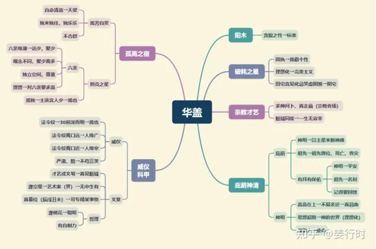

**核心要点**
华盖星与神佛、祖先及形而上学有关，若遇龙池凤阁能提升精神面或专业，更喜见科甲星同度，多属专业人士。华盖若遇空星及龙凤，适合艺术或五术人士。

**文昌文曲入十二宫**

***命宫***
孤僻，独善其身，与宗教（场所）有缘，易有一段时缘接触宗教。

***兄弟宫***
寡合，话不多，知己少；亦主道友。

***夫妻宫***
配偶有威仪，慈眉善目，亦主配偶话不多。

***子女宫***
子女少；对子女重视精神教育或从小接触宗教。

***财帛宫***
添香油钱,喜做善事，可从事医疗或公益或慈善事业。

***疾厄宫***
有拜有保佑；亦主胸闷、气结、贫血。

***迁移宫***
喜近宁静处或宗教场所。

***交友宫***
朋友少或道友多。

***官禄宫***
工作场合易近宗教场所或公司内有供奉神明。

***田宅宫***
住家附近有宗教聚会场所，家中易供奉神明或祖先。

***福德宫***
重视精神、信仰很重要。

***父母宫***
父母有威严，有善心，若逢刑星、哭虚、空星→父母易近宗教。