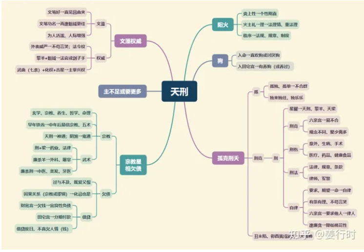

**核心要点**
天刑五行属阳火，化气孤克，主刑夭，庙旺时为吉，入庙掌兵。天刑遇太阳主武贵。天刑助擎羊星之威势，有孤傲、严峻、肃杀之意。

天刑虽为自律的星曜，但与天姚星（才艺或桃花）永居三合，两星又称为对星。另外“刑姚”与“左右”永不会照。

**天刑星入十二宫**

***命宫***
面恶心善，自律，不信邪，不喜欠人人情或钱财。要么是很喜欢狗，要么是很讨厌狗。

***兄弟宫***
兄弟姐妹间难沟通、多争执；或各自为政，不相干涉。

***夫妻宫***
意见相左，同床异梦，对配偶要求高，有共同宗教信仰可解。

***子女宫***
主子女个性倔强、不信邪；亦主子女问题多或体况差。

***财帛宫***
主借贷（房贷），不喜欠人人情或钱财。欠钱才会拼。

***疾厄宫***
主筋骨，酸痛、针灸；欠身体债→重养生。

***迁移宫***
逢吉→在外有权；逢煞→交通罚单或意外

***交友宫***
喜交三教九流之友（五术）或道友多，或军警界朋友多。

***官禄宫***
宜走法律、医疗、军警等行业；亦主易身兼数职, 欠工作债。

***田宅宫***
易养小动物（狗）；逢煞→易因产权或火厄惹官非。

***福德宫***
自律；宜清心或信仰宗教。

***父母宫***
与父母缘分薄。