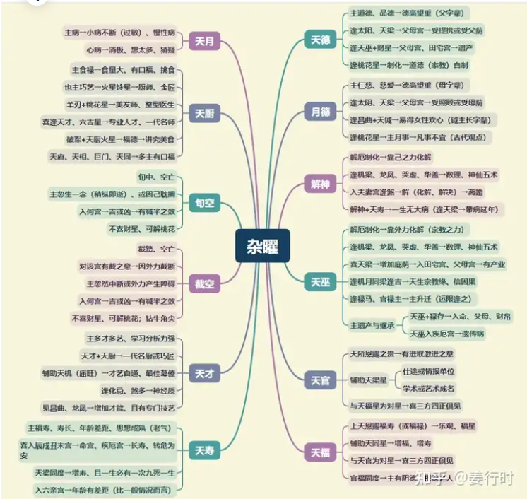

1.一般杂曜经常会被忽略，但其实在一些特殊宫位或组合下，杂曜也可以给出明确的讯号。

就以天月来说，有慢性病、小病的特性，一般天月与廉贞七杀或武曲七杀同度，主有鼻子过敏现象，还可以延伸为过敏体质。

2.天官与天福为对星，有句话说“天官赐福”，因此官禄主喜逢之，可增添官贵，更喜再见化禄或禄存，更增爵禄。

3.解神有“排解、拆解”的特性，尤其遇到破碎星，更主“分解、分开、分散”。

4.截空与旬空虽然杀伤力不如地空地劫，但却对吉星或好的现象有“减半”或“中断”的特性。

空星（地空、截空、旬空）若再遇天刑、华盖、天哭天虚，则易有灰色思想或宗教、哲学思想。