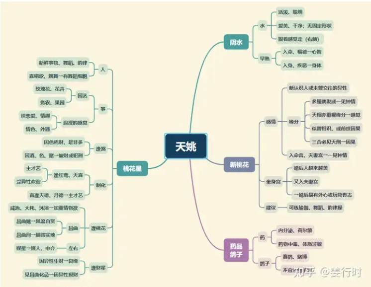

1.天姚属阴水，化气风流，入庙为风雅，才艺。天姚星增加异性缘，如主星属水，本身带桃花性质，逢天姚星会增加其吸引力，更明艳动人。

2.古书说“天姚庙旺，富贵多奴，好学能精，贪花恋酒”，即是说明天姚星若居庙旺之地，优点是“好学能精”，有才艺、才华，喜风花雪月、饮酒作诗。

3.天姚与天刑永为三合，天刑主“自律、法律、刑伤、医疗”，而天姚主“桃色、药品、花卉、荷尔蒙”，两星性质为冲突，也为相关，所以“刑姚”为对星，那到底是自律还是放纵？这就要以天刑、天姚会照的星曜来判断。

当天姚与桃花星同度或三合星曜中桃花性质过多，或情绪性质星曜过多，则易有“放纵、桃色”的现象；若天刑与“空星”或“孤克星”相逢，则自律性较强，甚至有孤僻性。