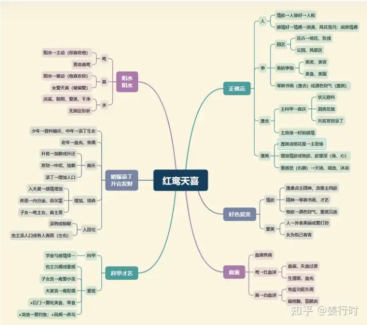

1.红鸾天喜双星一定遥遥相对（对照），红鸾、天喜基本性质偏向于“正桃花”，主人缘、才艺、科甲、良缘。当与咸池星或煞忌星同度时，会破坏正桃花的优点，而转向于“情感欲望、物质欲望”。

2.逢桃花星者，较注重穿着打扮，对包装、色泽、搭配等较敏锐，适合从事时尚、娱乐、餐饮、公关等工作。

3.红鸾天喜主喜庆，古人以“结婚、生子、登科”为三大要事，逢之必张灯结彩、灯火通明庆祝一番，所以“红鸾与火星相值者，科运仕运极享”。火星主“灯火通明”，红鸾与火星坐田宅宫，除主家中“发科甲（尤其逢科甲星会照）”，也主家中长年“灯火不灭（例如拜神或拜祖先的灯或香火）”。

4.“笙節庙堂格”，是指红鸾居命身宫，逢紫微、太阳、太阴等星，主“任职中枢”，现代社会则为在中央政府（或直辖市）机构内服务，或大企业内居要职。

5.若红鸾与太阴居亥宫坐命宫，称为“月照天门格”，也是“笙節庙堂格”，除主科甲登第，也主因妻（或女性亲人）而贵。