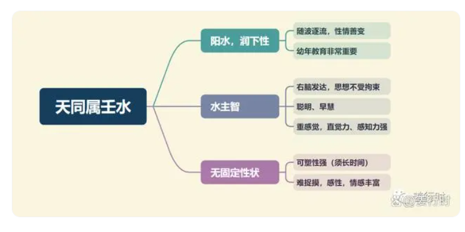
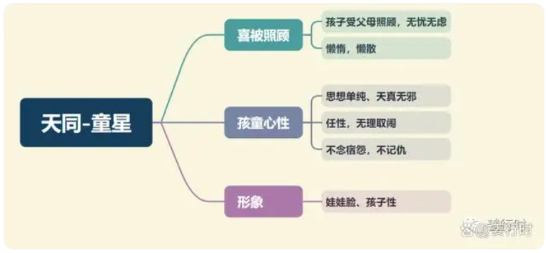

**最核心要点**

***1.壬水、阳水***
1.水会因地心引力作用而往下流，容易有随波逐流的特性，水没有固定形状，装到任何容器里都能变成这个容器的形状，所以水星坐命之人（天同、天相、破军、太阴）的幼年教育非常重要，父母宫及从幼年到求学阶段的大运父母宫都要留意。
2.水星、水局坐命之人右脑发达，容易有艺术天分或第六感敏锐，天同若见昌曲或见空劫，可以在小时候培养音乐、绘画方面的兴趣和才艺。一般见昌曲多主学习力强、快，甚至长相福气秀气得人疼；见空劫（尤其空星）则容易表现异于常人。

***2.化气为福***
福者，福气也，所以天同星常有福星高照的现象，以及它很喜欢分享快乐或助人。天同坐命或坐福德宫的人，一般比较乐天派，有福气。
1.“有福气”的面相、体相：
    耳厚而圆者→ 耳主水星，也主贤，耳厚而圆者主有财可食
    耳有垂珠→ 耳垂部位长的像圆珠子，主一生衣食不缺
    垂珠朝口→一般耳垂是向下长，而此垂珠是往嘴巴方向长，主有财，有口福，且一般多主长寿
    脸部丰腴，尤其下巴位置，有双下巴更好
2.天同与贪狼暗合
两星相比，贪狼主物质，天同主精神，两星均喜享受、玩乐，天同的玩乐多偏向精神面，贪狼则偏向物质面。
天同主常有突如其来的喜悦，不过大多是“小”的喜悦，比如中奖200元，路边停车时刚好前车离开；贪狼则比较有机会得到大奖，因为“贪火格”（贪狼+火星）、“贪铃格”（贪狼+铃星）的关系。（天同想要得大奖，看天同的对星 ：天梁，天梁为父母主，荫星。因为天同的最大奖，一般是父母给予（赠与、遗产）。）
天同坐命父母宫必为武曲，若武曲又见财星、天巫，且命宫天同与天梁三合，则易有父母赠与的财富（或遗产）。又或是天同见天梁，且天梁与禄星同度又见天巫亦是。

3.天同不论坐落何宫，均与福气、福分有关，至于是“施”与“受”，也可以结合年龄来看，比如，天同居兄弟宫，若自身为长兄姐，则主自身呵护弟妹；天同居夫妻宫，配偶年长，则主配偶呵护自己

***3.福德主***
天同星为福德主，是掌管福德宫吉凶的主星。
不论天同坐落何宫，逢吉者，主命造因该宫得到福报、福分；逢凶者，则因该宫消减福报、福分。
例如，天同居父母宫逢吉多，则主可受父母、上司呵护；天同居父母宫逢煞多，则主易因父母、上司劳心劳力。
天同居子女宫逢吉多，则主自身对子女呵护、疼爱（福及子女）；天同居子女宫逢煞多，则主对子女溺爱或纵容（放纵其任性），使自身常为子女劳心劳力（消减自身福分）。

***4.童星***
古书中并没有“童星”的词句，只是依天同星的特性，把它联想与童星有关。以及天同与天梁为对星，一为福星，一为荫星，一为小孩，一为老人。

1.天同不论坐落何宫，均可主该宫之人（或其一），易有娃娃脸或孩子气，另外也主该宫有“大小”之分或年龄的差距。
2.天同的“懒惰”一般喜四煞星（羊陀火铃）其一来度，反可降低天同的惰性，尤其此煞星居庙旺之位。一般四煞星居庙旺位时，主其优点多于缺点。

**天同星入十二宫**

***命宫***
聪明活泼，懒散被动，有依赖心，喜助人，娃娃脸或孩子性，是一个懂得生活享受，明白生活情趣的人。

天同化禄：主解厄福气好，然而过于懒散
天同化权：会变得劳碌，但能激发干劲，减少惰性
天同化忌：天同善协调，为乐观主义者，化忌可能会较不快乐，但会较为努力；若自化忌则不善协调

***兄弟宫***
自己年长→宜照顾年幼者；自己年幼→可得照顾和疼爱。逢煞，易因兄弟状况多而忙碌

天同化禄：兄弟和谐、大方，但可能较懒散
天同化权：兄弟有主见，掌权，乐观又积极
天同化忌：兄弟可能较不和谐，但命主对家庭有责任感

***夫妻宫***
可因配偶得福或福及配偶。另主配偶比自己年纪小，或配偶有娃娃脸或孩子性，配偶重休闲。夫妻感情和睦（不加煞忌）。男性以晚婚为宜，宜娶年轻女性为妻，女性也以迟婚为佳。

天同化禄：配偶对工作事业有帮助，感情融洽
天同化权：主配偶懂得享受，有主见，掌权
天同化忌：主夫妻感情不一定协调，又不得不付出

***子女宫***
福及子女。子女依赖心重，易尿床，易为子女付出。逢吉，老来有回报；逢煞，子女问题多（健康或学业）

天同化禄：孩子乐观大方开朗
天同化权：乐观有主见，又喜享乐，个性积极
天同化忌：固执或劳碌，命主可能溺爱孩子

***财帛宫***
天同不主财，在财帛则主不用为衣食发愁，会想要赚自由之财，喜欢不太劳碌的工作。重休闲或享受，宜旅游业、休闲业、童装、童书或幼教、医疗。
财帛宫持天同星的人，不会以赚钱为直接目的而拼命工作（化忌除外），会靠着对工作的热诚立下基业，中年以后，财富渐增。天同也不喜欢仰赖父母长辈打下的基础，因此多是白手起家之型。

天同化禄：有钱可享，若不积极，可能无作为或懒于赚钱，因为想赚轻松又自由之财
天同化权：财运好，努力赚钱，有可能创业
天同化忌：爱钱，喜欢赚钱

***疾厄宫***
天同星临疾厄宫的人，一生灾病少，相对较容易病的部位是胃、肠、肾脏、泌尿系统。

天同化禄：心宽体胖，天同化禄喜入疾厄宫，就是有疾也容易痊愈
天同化权：主身体健硕，好动闲不下来，内心乐观开朗
天同化忌：主容易膀胱肾脏有问题，女命主可能经期不调

***迁移宫***
个性随和，人缘好，出外发展时会遇到贵人相助，在外口福好，平安。逢煞，出外辛劳或不悦，或没时间休闲。

天同化禄：主在外广结善缘，乐观大方，但做事可能不够谨慎
天同化权：在外有权，好享受，宜出外发展
天同化忌：需要出外发展，在家被忌冲，在外注意由人际关系引起的是非

***交友宫***
逢吉，因友得福，尤其是年长之友，易有忘年交（童星）；逢煞：易因友而无福，另主因友惹祸。

天同化禄：交的朋友乐观大方，且爱玩，注意流于酒肉朋友
天同化权：朋友乐观有主见，注意酒肉朋友无益
天同化忌：会因对朋友太好而损财

***官禄宫***
逢吉（尤其又遇财星），福星高照，可为该公司带来好运，但易处事懒散或憨直；逢煞，辛劳得财，一生努力。

天同化禄：可轻松进财，然而不够积极
天同化权：较有积极度，可靠人脉关系、协调性质创业
天同化忌：敬业，但若创业，可能会因支援或人脉不足而失败

***田宅宫***
在家享福，懒惰。天同单星看不出是否有房，要加四化判断。喜与太阴同宫，田宅丰厚，主大富，因为太阴为田宅主。

天同化禄：主小时住宽敞房子；喜在家，家庭和乐
天同化权：喜购买高档家具家电、娱乐器材
天同化忌：家中水电容易出问题

***福德宫***
天同为福德主，入福德宫为得位，主福厚，享福，但也会懒惰，想多做少。逢吉，好命，一生无大灾难；逢煞，劳心或劳力，是非多。

天同化禄：懂得生活情趣，主长寿有福可享
天同化权：想拥有的东西一定要；另指另一半可能极有主见
天同化忌：容易沉溺于享受而败财

***父母宫***
父母和蔼可亲，对子女照顾周全，父母其一易娃娃脸或孩子性。逢吉，父母疼爱，互动佳；逢煞，父母一生操烦，另主父母老运为自身操烦。

天同化禄：父母乐观大方
天同化权：父母乐观、掌权，有主见
天同化忌：主在意父母，父母操劳，不懂享福，或较为固执

**天同星组合变化(入命)**
中州派王亭之老师认为天同星的福是“从无到有”，说的更具体则是“辛苦后得到的成果”，因此我们会把天同星与白手起家联系起来。
天同星如同宗教所言的福泽、福田，就如我们在冥冥之中种下的因（福或祸），一般应验时间或事物，大多与天同星所在的宫位有关。

***天同太阴子午宫：对宫空宫、三合天机天梁及空宫***
***天同独坐卯酉宫：对宫太阴、三合巨门及天机***
1.天同太阴坐命，性急心慈，处事温和，感情丰富而脆弱，擅长分析与策划，聪明而机智。自尊心强，有很好的异性缘及外缘。
2.天同居子午两宫虽三合同为天机天梁，但子宫天同与太阴均为庙旺，而午宫两星均落陷，所以一般来说子宫较为吉利。但因两星都是水星，一为阳水（天同）一为阴水（太阴），均属于右脑发达（感性、重感觉），因此情感与精神面为其重点，又太阴为月亮，有阴晴圆缺，因此人生或情感上易有抑郁寡欢的现象（尤其午宫落陷的天同太阴），若命宫与福德宫（太阳巨门）遇太多煞星化忌或孤克星（孤寡、哭虚、天刑华盖），容易有抑郁倾向。
3.此组合具备“马头带剑格”的条件，指的是：羊刃居午宫守命且天同太阴居午或子宫，或贪狼居午宫再逢化禄或化权。此格局虽有富贵，可威震边疆，但是不耐久，且亦有刑伤。此命为人处事作风大胆强悍，易单刀直入而不妥协，所以适合在激烈竞争中出人头地，不适合温文尔雅的环境。其次也可说武职大利，适合军警、医疗、技术。

***天同巨门丑未宫：对宫空宫、三合天机与空宫***
***天同独坐辰戌宫：对宫巨门、三合天梁及太阴天机***
1.巨门化气为暗，巨门的暗偏向于是非，因此天同巨门的福来时易有是非，或是在“是非中享福”。
2.丑未宫的天同巨门星曜力量为落陷，且三方四正有两个空宫，所以一般情况下，比较没有天同独坐辰戌宫时有冲拼之力。而辰戌宫三方四正均有主星正曜，且为机月同梁格，因此辰戌宫的天同巨门组合阴暗性质较为轻
3.天同巨门坐命的人，个性温和善社交，外务能力强，待人接物较圆满，脑筋聪明，温柔而多情，感情生活复杂，人生价值观建立于享乐与金钱上。

***天同天梁坐寅申宫：对宫空宫、三合天机与太阴***
***天同独坐巳亥宫：对宫天梁、三合天机巨门及空宫***
1.天同天梁坐命的人，喜欢户外活动，交游广阔爱面子，内心善良脾气硬，喜欢宗教活动，喜欢结交朋友，很擅长人际关系。
2.天同居寅申巳亥与天梁同宫或对照，所以天梁星对其影响不小，尤其是巳亥宫天梁星落陷时，其缺点“顽固、挑剔”会影响天同星的福泽。其次三合天机巨门也是动荡组合，所以天同虽居巳亥为庙旺之地，却是动荡不安。另外，若天同星坐命巳亥宫，则福德宫为丑未的太阳太阴同度，主其人思想易反反复复、时明时暗，故此组合不宜再遇天马，更增加动荡性质。
3.而寅申宫为天同天梁同度，此时寅宫天同天梁为庙旺位，而申宫的组合确是天同旺位、天梁落陷，因此天同天梁居寅宫比申宫为佳，天梁陷位时易先遇灾难再逢凶化吉。另外，此二星同度易有游走法律或道德边缘的现象，因为天同崇尚自由，而天梁却是讲原则、不徇私，所以有时会让此组合坐命的人很困扰。
3.天同天梁居寅申宫也是机月同梁格的组合，所以主其有规律性质，以及有白手起家的现象，因为天同有更新、进化特质，天梁有逢凶化吉特质，所以若入六亲宫，喜逢吉星相会，不喜煞星和桃花星来聚，易多事端或亲情有损。
