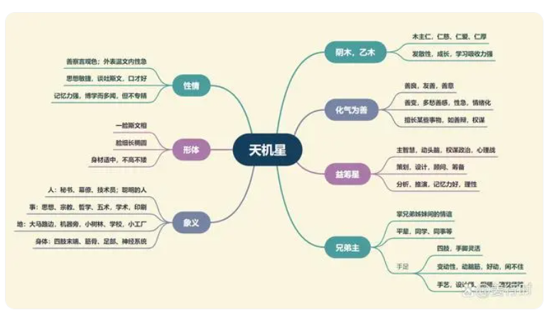

**最核心要点**

***1.天机属木，阴木——主仁，仁爱；有发散性（想象植物生长）***
***2.化气为善——善良；善变；擅长（分析、策划、推演）***
***3.兄弟主——掌兄弟姐妹情谊；手足、四肢***
***4.动星 ——动脑，思考，智慧之星；财产流通性大***

**星曜组合要点解读**

***1.天机是主星中的动星之一***
天机+天马=身体的活动、波动，例如：业务、运输
天机+火铃=思想的躁动或行为的躁动，例如：高血压、失眠、赛车
天机+空劫=思想的跳空，如设计，创新

上述三组星曜组合一般以坐命身宫为主，若坐落福德宫，则增加思想、精神的波动，多属劳心或心思不定的现象。

***2.天机善分析***
分析别人的事情时条理分明、一针见血，但分析自己的事情时却错综复杂、千头万绪，可谓当局者迷。
因为天机的阴木有“随风飘、墙头草”的特性，所以天机喜见稳定星曜，例如左辅右弼、禄存等星，也喜见化权的星曜，可使阴木转变为大树，更加有主见和决断力。

***3.兄弟宫主的作用***
兄弟宫可论断兄弟姐妹的多少，与兄弟姊妹互动关系的好坏；兄弟主天机星则掌管一生与兄弟姊妹的手足情深、情谊。
兄弟宫吉，兄弟主凶，主兄弟姐妹平时相处融洽，当自己发生事情、问题，需要他们的帮助救援时，兄弟间无力帮助，甚至落井下石。
兄弟宫凶，兄弟主吉，主兄弟姊妹平时相处不融洽，但当自己发生问题，需要他们的协助时，兄弟间情义相挺，或者雪中送炭。
若命盘上天机坐落的宫位逢煞，大运命宫或者大运兄弟宫行至天机坐落的宫位，则主易因兄弟姊妹或知己或合伙而引起是非纠纷。

**天机星入十二宫**

***命宫***
天机星入命宫的人喜欢动脑筋，个性温和，待人客气，又好行善，所以人缘很好，深受他人欢迎。反应敏捷，智商高又有洞察力，有卓越的策划能力和独特见解。天机入命的女性比较细心、沉着、冷静，且桃花强。

天机化禄入命：主聪明、圆滑、点子多
天机化权入命：主谋略、精打细算、能干
天机化科入命：主智慧，聪明善动脑筋，为企划高手
天机化忌入命：天机星性聪颖，化忌会钻牛角尖，多疑，固执

***兄弟宫***
容易有男性兄弟至少一人；脑筋特强，可能对学术研究有兴趣，且有所成就。若逢凶煞，兄弟少，缘分薄，不相扶持且互扯后腿（因有四煞凶星，而非天机星的关系）。

天机化禄入兄弟宫：主兄弟聪明有智慧
天机化权入兄弟宫：主兄弟极有主见，易起争端，但为人善良
天机化科入兄弟宫：主兄弟清白、斯文，具学术研究特质
天机化忌入兄弟宫：主至少有一位男性兄弟，兄弟可能固执，命造对家庭有责任

***夫妻宫***
喜聪明的配偶，情同手足；婚后配偶善良，智慧，人缘好，易与配偶斗智；若逢煞忌，则有些神经质。天机星独坐夫妻宫的人多属早婚型，女性会嫁给学术上颇有成就的男性，男方的年纪愈大愈有利。

天机化禄入夫妻宫：另一半聪明、滑头
天机化权入夫妻宫：另一半很有主见，较容易争执
天机化科入夫妻宫：另一半洁身自爱，可能有学术上的成就
天机化忌入夫妻宫：对感情钻牛角尖，夫妻有心结，沟通问题

***子女宫***
天机星入子女宫的人，主生儿子（若有生年四化则几率更高），并以聪明为特征，但是聪明不一定能以学校的成绩来判断，孩子若不喜欢传统的学科教育，也会容易有天分学习特殊技艺。因为传统教育得看子女的官禄宫才能得知是否会读书出色。若天机逢煞忌，可能有同父异母或同母异父所生之现象。

天机化禄入子女宫:子女活泼好动，有智慧
天机化权入子女宫:子女机敏有主见，善察言观色
天机化科入子女宫:子女口才好，适合学术或教职
天机化忌入子女宫:子女固执，可能伤脑筋

***财帛宫***
白手起家，靠自己智慧及双手挣钱;适合现金生意，小资本生意，周转快的短期投资。钱在手中不安稳，流通性大，得到的钱会想再投资（花）出去。适合入财的方式：老师、平面设计师、艺术、企划、装潢、出版、木器、股票分析。

天机化禄入财帛宫：钱财流通性大，财多；若加吉星则大进大出，遇凶星可能有损
天机化权入权帛宫：善于钱财的运用和调度
天机化科入财帛宫：适合学术研究或分析
天机化忌入财帛宫：不主损财，但会为钱费心机，适合赚五术之财（五术：山、医、命、相、卜）

***疾厄宫***
天机属阴木，主肝胆，肝火旺则性躁惊恐（急躁）；神经系统麻痹；四肢易受伤，尤其是手。天机在疾厄宫易小题大做，浅眠易醒，思想烦躁。

天机化禄入疾厄宫：主聪颖，思考清晰
天机化权入疾厄宫：易操劳，会为工作学业熬夜，注意胆、肝保养
天机化科入疾厄宫：会注重休闲生活，身体也会适度放松，较不易生病
天机化忌入疾厄宫：主头疾，脑部神经疾病，肝胆问题，不要熬夜

***迁移宫***
喜交友，四海之内皆兄弟；若有机会在异乡发展会得心应手，在外机巧灵敏，好动，点子多，适于多变动性质的工作或活动，宜往远地发展，越远越活跃。

天机化禄入迁移宫：主适合远行、在外发展
天机化权入迁移宫：主远行，若于四马地（寅、申、巳、亥四宫），再遇天马，主出国，且为有计划性出国
天机化科入迁移宫：主有出国旅行机会，在外贵人多，且斯文、具学术地位的贵人为主
天机化忌入迁移宫：欠外出的债，易离家外出，要注意交通事故、外伤

***交友宫***
友如兄弟，情同姐妹，但动星不耐久，朋友圈十年一变；交往的朋友，大都为专业人才或精于某一学术或技术，拥有非凡的才干，聪明且善良，脑筋都很不错，可能和宗教有关。逢煞要防友背叛。

天机化禄入交友宫：可结交到有才华或有钱的好朋友，朋友多
天机化权入交友宫：可交到有智慧的朋友，能力强有地位，但会比较精打细算
天机化科入交友宫：可结交到斯文，有学术地位的朋友
天机化忌入交友宫：对朋友好，但可能有容易想太多的朋友

***官禄宫***
靠脑筋、手脚的工作都很合适，工作上易动脑思考处理事情，适合坐办公室、非动态性的工作，因为天机为动脑之星。也可能有独特的思想，可能走向学问的专门研究或是杂志、报社的编辑，也可能成为一个艺术追求者，例如书法家、设计师。（补充说明，职业收入主要看财帛宫，而非官禄宫）。

天机化禄入官禄宫：善赚智慧财，凭智慧创业，但不要过于耍小聪明，避免华而不实
天机化权入官禄宫：善于用智慧规划创业，加煞忌为创业辛劳
天机化科入官禄宫：可从事靠脑子的工作，属静态性工作模式
天机化忌入官禄宫：可从事器械或需要专业技术的工作

***田宅宫***
较无法依靠祖先遗留的产业而发迹，必须透过自己的奋斗自置产业（白手起家），因此在外多奔波。还主易在家中种花花草草，或住公园附近，或住家附近易有花草业。

天机化禄入田宅宫：主房子宽敞
天机化权入田宅宫：主房子越换越大，有计划性置产
天机化科入田宅宫：很注重家中摆设，会花心思在布置上
天机化忌入田宅宫：家中有人易伤脑筋，或命造易宅在家

***福德宫***
有求知欲和好奇心，喜欢思考，所以对文学、艺术、宗教、命理、玄学，甚至未来的一切都抱有兴趣。易行善，有智慧，对手工艺有兴趣。心闲不住，满脑子念头。

天机化禄入福德宫：懂得安排晚年生活，喜欢宗教哲学，福德厚，福报佳
天机化权入福德宫：喜求知，尤其是宗教、哲学、五术方面
天机化科入福德宫：晚年有机会接触宗教
天机化忌入福德宫：早年易花钱，晚年忧郁（因天机化忌伤脑筋），宜有宗教信仰

***父母宫***
父亲和蔼可亲，良善平易近人，对朋友好。

天机化禄入父母宫：主父亲大方，聪明圆滑
天机化权入父母宫：父亲精明能干
天机化科入父母宫：主父亲明理，斯文，有学术气质
天机化忌入父母宫：可能与父母理念不合，但在意父亲

**天机星组合变化(入命)**

***天机独坐子午宫：对宫巨门、三合天同天梁及太阴***
***天机巨门居卯酉宫：对宫空宫、三合天同及空宫***
南派所传，天机星与巨门星是对星。
1.天机主善，巨门主暗；天机主谋士，巨门主是非。若以联想力来说明，天机主人的想法，巨门主人的口舌。
天机星逢吉，巨门见煞—— 主修心不修口，刀子嘴豆腐心，易得罪人；
天机星逢煞，巨门见吉——主修口不修心，讲是一套，做又是一套。
因此，天机坐命之人，巨门不可破（逢四煞）, 破则易有口舌之灾，或者婚姻不美。

2.子午宫天机星独坐，所以筹划、分析的能力较为凸显，也比较有主见，尤其是午宫天机星，虽然对照的巨门为暗星，但巨门三合辰宫庙旺的太阳，可减少巨门暗的缺点。而子宫的天机星所对照的巨门星，太阳落陷居戌宫来相会，是非较多也有些辛劳。

3.古文说：“天机卯酉，必退祖而自兴”，因天机巨门居卯酉宫坐命时，田宅宫坐守七杀星，有祖业不留之象，因此天机巨门有白手起家的特质，同理，若坐守夫妻宫，也容易貌合神离，再遇四煞容易有再婚的现象。

4.机巨门组合口才佳好辩，有特殊技能，多学多能，但感情较为复杂，耐力强可白手成家，凡事喜欢自己动手，但说话较容易得罪人。

***天机独坐丑未宫：对宫天梁，三合天同及巨门***
***天机天梁居辰戌宫：对宫空宫，三合天同太阴及空宫***
1.天机星居丑未为落陷，此时天机星的缺点较为明显——浮躁、不安定、犹疑等，因此需要夫妻宫及父母宫吉，才能有解救。先天有父母栽培，后天由配偶扶持。

2.辰戌宫为天机天梁同度，古书云，“加吉曜，富贵慈祥”，“机梁七杀破军冲，羽客僧流命所逢”，就是在说机梁逢吉星和见煞星时（尤其逢空劫、化忌）的现象。

3.古书还有“机梁会合善谈兵”，“机梁同辰戌，必有高艺随身”，“机梁同照命身宫，偏宜僧道”等说法，这是因为天机星和天梁星都对神秘、神仙五术或信仰、信念感兴趣，喜让自己有独特见解。在古代仅有兵法与长生这两件事能让机梁一展才华，让一般凡夫俗子有所敬佩。但当今社会资讯发达，因此机梁对流行的资讯（财经资讯、新闻热点）、人性方面、心灵方面也都很感兴趣，不局限于兵法、法律。

4.天机天梁组合为善荫朝纲之格仁慈之长。心地善良，性情温和，品学兼优，自尊心高，待人有礼，大多数人有技艺在身。

***天机太阴寅申宫：对宫空宫、三合天同及天梁***
***天机独坐巳亥宫：对宫太阴、三合天同巨门及空宫***
1.天机星与太阴星居寅申巳亥四宫，寅申为同度，三合天同星与天梁星，为“机月同梁格”，是指命宫及三方见天机、太阴、天同、天梁四星。古文云，“机月同梁作吏人”，“一生吏业聪明”，古代吏人为公职人员，且政府是最大最垄断的就职机构，工作福利最稳定。而今除了公职以外，私人企业、外企的规模与福利有时也不输公家机关了。
此格之人一生易与公职有缘，或易参与政党活动，也适宜到规模大的民营企业或者外企任职。

2.天机星居巳亥宫，因三合天同巨门为落陷，若太阴居巳宫也是陷位，因此天机星居巳宫比较吉利（因太阴居亥庙旺），但巳宫不喜戊年生人，因为天机星化忌受擎羊陀罗来夹，“羊陀夹忌”，主受困或易错失良机，且好耍小聪明。

3.天机太阴组合头脑灵活，文质彬彬，有阴柔之气，是个仁慈坦荡又柔弱的人，虽然聪明但多思，喜欢参考别人意见而主见较低。
