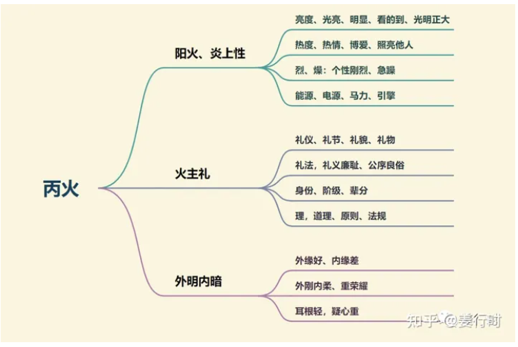
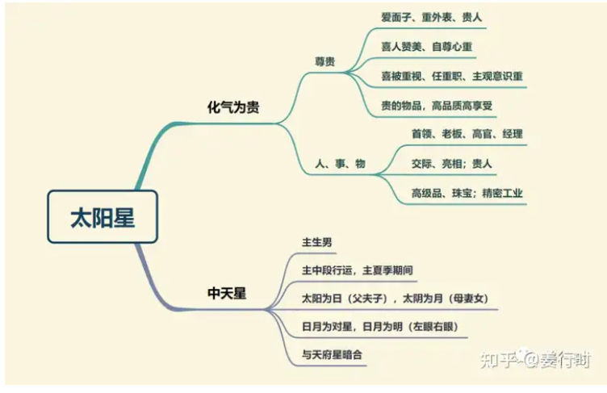
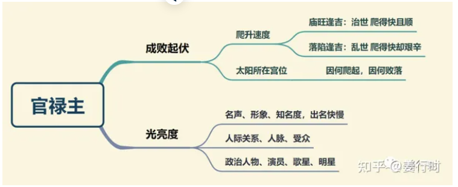
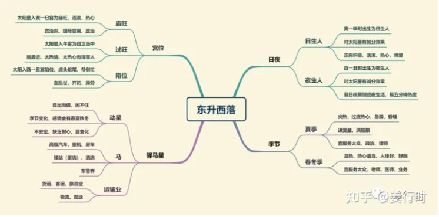
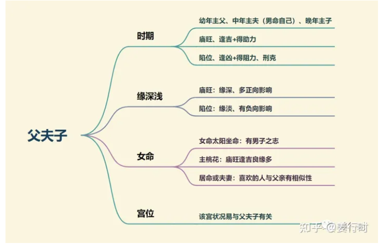

**最核心要点**

***1.丙火（阳火）***

1.解释一下外明内暗，是因为火焰燃烧时外缘是黄色，内缘是深蓝色，所以外明内暗可以理解为外刚内柔，外缘好，内缘差。
外缘好是指跟外面的人相处融洽，而内缘差是指跟自家人的相处不太融洽，我们可以联想以下原因：
    1.太阳每天在外奔波，发光发热，帮助他人并得到称赞，回到家时已经没有体力和能量了；也可能是因为帮助家人时得不到称赞，太阳重名，被称赞这点很重要。
    2.太阳为父星，古时男主外、女主内，所以太阳坐命之人比较少管家里的事，也可以理解为忙于事业或外人之事，少关心家人。

***2.化气为贵，为中天星***

1.太阳与太阴为对星，太阳主贵，为官禄主，太阴主富，为财帛主及田宅主，如果两星庙旺相会或对照，一般可主富贵随身。
2.我们回顾一下紫微星，紫微化气为尊，也是官禄主，紫微的尊是因为他的地位（帝座）、阶级使其有领导特性；太阳的贵是因为声名好、风评佳而吸引人们跟随。
3.太阳的阳火，使其喜欢争辩道理，且喜欢当场赢人的感觉；而紫微为阴土，虽然也喜欢赢的感觉，但与太阳相比稍有阴沉的特性，所以喜怒不形于色。
4.紫微和太阳在花费上一样喜欢“名贵”之物，但是太阳除了重视“名”之外，更重视质感、实用性；紫微则是重名，更重“地位的象征”。
5.太阳主贵，主声名（光亮），所以如果不见太阴、禄存星，一般仅主名气大，却不一定富有，所以太阳喜见禄存、太阴，才能有名有利或先名后利。至于化禄，更喜太阴化禄来会，而不是太阳自身化禄，因为太阳化禄虽然有财运，却更容易花费暴增。
6.紫微、太阳、太阴三星为中天星，紫微为帝，太阳为父星，太阴为母星，这三颗星都具有“先天的领导”特性，所以太阳太阴也喜欢百官朝拱和吉星成党。

***3.官禄主***
太阳星为官禄主，掌管官禄宫的名声、知名度与爬升速度，也可以说，太阳星不论坐落何宫都与名声有关，详见下图。

***4.东升西落***
太阳星与太阴星取宇宙、自然界的太阳、月亮为象征，天上的太阳早上东升、晚上西落，而太阴则是晚上东升、清晨西落。太阳、太阴的庙旺亮度是十四颗主星中最容易判别与熟记的，详见下图

***5.父、夫、子星***
太阳星与父夫子三者有关，太阳星坐守的宫位（尤其命、身、父母宫、夫妻宫、子女宫）庙旺与否，以及逢吉逢煞，与这三人息息相关，详见下图

太阳太阴两星一定要搞懂，因为这两颗星掌管人一生“父夫子”“母妻女”的情感、缘分，非常重要。

**太阳星入十二宫**

***命宫***
命宫持太阳星的人，面貌丰满，体格魁梧，个性豪爽，秉性仁厚，好恶分明，为人敢爱敢恨，待人热忱，所以受友人敬重，是一位风云人物。若庙旺，则受父亲正向影响多，感情好；若落陷，主先勤后惰，五分钟热度（还需要参考日或夜生人）。

太阳化禄入命宫：为人大方，有老板格、主管格
太阳化权入命宫：主刚强，创业，固执，好表现，求胜心强，男女命皆易有大男人（大女人）主义。
太阳化忌入命宫：不利男命，主劳碌；化忌会使性子，易耍脾气，不得人缘。

***兄弟宫***
阳入兄弟宫，可因兄弟或知己成事或得名。庙旺主兄弟成就高，有助力，落陷则主兄弟不成器，太阳亮度影响兄弟成就高低。太阳入兄弟宫的人，多半和兄弟姊妹间有很频繁的交往，因为太阳星活动力强，暗示兄弟姊妹中有人在交际、社会应对方面的关系良好（还要参考四化）。

太阳化禄入兄弟宫：主兄弟为人大方，注重人际关系，可能话多
太阳化权入兄弟宫：主兄弟喜出风头，掌握实权，兄弟或母亲比自己有主见
太阳化忌入兄弟宫：兄弟或母亲比较顾家，或付出较多

***夫妻宫***
太阳入夫妻宫的人，配偶通常比较有力量和才干，女命期望丈夫上进，活泼热情，丈夫易大男子主义，但却很有才华；男命喜欢中性风、爽朗的女性，期望妻子能帮助自己的事业。
若落陷、化忌、加煞则适宜晚婚，男女同论。因为太阳为争论之星，轻则易夫妻争吵、争论较多，重则分离，因此如果有这种命局或者运限逢之，最好夫妻不要常在一起，比如经常出差，或者因故两地分居，反而能相安，因为分离已经让凶星发挥作用了，凶星已经满意，所以较不为灾。

太阳化禄入夫妻宫：男主得配偶之助力，有机会成就自己的事业；女主当老板娘的机会高
太阳化权入夫妻宫：主配偶能干掌权，男命需防意见不合影响婚姻
太阳化忌入夫妻宫：女命因对感情过于付出，不利婚姻；男命夫妻宫冲事业宫（官禄宫为对宫，化忌对冲），不利创业

***子女宫***
表示命中有儿子，因太阳主儿子；太阳入子女宫的人，子女活动力非常强，家庭内充满活泼的朝气，子女们喜欢运动，喜欢讲道理，如会三台、八座、左右、魁钺、禄存等吉星，子女会有了不起的成就。
太阳庙旺，易得子，且子女多，若在阳宫（寅、辰、午、申）男孩较多；太阳落陷、化忌，得子不易（晚得），或子女少；太阳落陷又化忌或加羊陀，女命注意小产、流产。

太阳化禄入子女宫：子女对自己的工作事业有帮助
太阳化权入子女宫：主子女可成为好帮手
太阳化忌入子女宫：主为儿子操劳

***财帛宫***
以官求财，财易露白，出名后得财；职业宜政界、律师、贸易、运输业。
太阳庙旺，好面子，花钱也多，会截空、地空、地劫，花钱由不得自己，总有许多事来挖自己的钱财。太阳落陷反而更善于理财，但是要特别注意，如果行凶运，易遭诬陷，反而受累影响声誉。
太阳在财帛宫无论明暗，皆主对他人钱财一丝不苟，善于打理，但是不重己财，这是因为太阳博爱无私的属性。

太阳化禄入财帛宫：可赚大钱，轻松赚钱，但为人过于大方，应量入为出
太阳化权入财帛宫：财帛方面有权，易创业，发展迅速，辛苦劳碌得财
太阳化忌入财帛宫：男命主不利创业，女命主夫星黯淡，易为感情付出

***疾厄宫***
太阳入疾厄宫要注意心脏、血压、眼睛/视力、多汗/中暑，不自觉的面部抽动等。
太阳庙旺主阳明之疾、高血压、脑溢血；太阳落陷主眼疾；太阳化忌近视，但还要注意会合星曜组合状况。

太阳化禄入疾厄宫：心地光明，不太计较
太阳化权入疾厄宫：太阳不喜化权入疾厄宫，可能因过度操劳而造成身体问题
太阳化忌入疾厄宫：太阳主个性，化忌内心过燥，应注意高低血压，精神疲劳等；太阳太阴皆主眼睛，要注意爱护眼睛，保护视力

***迁移宫***
太阳庙旺，出外成名，出外得贵，个性直率、好管闲事，在外行为正派，宜早年在外独立生活，尤其是日生人。太阳落陷，易见是非或诽谤，也会有成就，只是帮扶的人比较少。

太阳化禄入迁移宫：宜外出发展得财，可能有重虚名的倾向，喜交际应酬
太阳化权入迁移宫：宜外出发展得权，外出较易得男性贵人帮扶；男命主创业，可掌实权，女命可靠男性顾客进财
太阳化忌入迁移宫：宜出外，在外劳碌，若在家则冲命宫，易有是非

***交友宫***
喜欢光明正大、积极热情的朋友，喜欢结交男性朋友。庙旺，朋友多助，朋友多，本人也很好客，所结交的朋友多积极进取、善于交际。落陷做减吉论，先热后冷，或有热有冷。

太阳化禄入交友宫：朋友多，朋友大方，容易交到有名声且比自己有财的朋友
太阳化权入交友宫：朋友掌权，易交到有地位并掌握权力的朋友，甚至政治人物
太阳化忌入交友宫：对朋友很好，但不一定多，朋友属阳光型，或较为固执

***官禄宫***
太阳为官禄主入正位，有事业心，光明正大，若遇禄存，有名声+有钱。庙旺，主在校活跃，事业上顺利；落陷，事倍功半或日夜颠倒，非常敬业比较辛劳。
太阳在官禄宫，常处在一种高度竞争的工作环境中，例如政治家、律师、做贸易等，太阳坐官禄宫又在午宫独坐大吉，此人可创下大事业。太阳午宫坐命不一定好，过旺，发散性太强，但太阳在午坐官禄宫很好，真正的“日丽中天”。

太阳化禄入官禄宫：主有主管格，用巧思做事
太阳化权入官禄宫：主有老板格，有机会从事政治、外交等事业方向
太阳化忌入官禄宫：创业不一定好，因为化忌的格局不如化权大，但相当敬业，宜上班

***田宅宫***
太阳入田宅宫，代表家很光明、光线充足，在家勤快。庙旺，表示有祖业，在寅、卯、辰三宫，可得祖业，且会发扬光大，做得更好；居未、申二宫，得到手的祖业将会有损耗；落陷，无祖业，白手起家。
太阳居田宅宫宜住高楼，较为顺当。太阳若与太阴同在田宅，不动产多、住家大，并且同在未宫比在丑宫更好，这叫做“日月照壁”。

太阳化禄入田宅宫：主小时候居住的房子宽敞、明亮；未来房产可能会多，或喜欢住宽敞明亮的房子
太阳化权入田宅宫：主小时候住的房子大、明亮；命中会有房
太阳化忌入田宅宫：容易习惯待在家，居家注意采光

***福德宫***
太阳在福德，做事积极卖力，所以生活非常的忙碌，虽然忙碌，却忙中享乐，对活动性、动态性的事情有兴趣，也代表喜欢忙碌。处事积极，个性略嫌急躁。太阳的明暗亮度，主福之厚薄，贵人之强弱。庙旺，乐观进取，落陷，劳心劳力，是非多，女命感情不顺。

太阳化禄入福德宫：主精神面，喜欢户外运动，或是兴趣多元；喜欢和社交有关的在线游戏
太阳化权入福德宫：热爱户外活动、运动或是极限运动；晚年喜社交，好交友
太阳化忌入福德宫：固执，脾气不好，容易花钱，或是花钱在男人身上

***父母宫***
太阳在父母宫，与父亲缘分深，父亲可能大男人、正派、勤快。若庙旺，心善寿高，社会声名佳；太阳落陷，父亲可能较为劳碌，父亲运势（健康）差，对自己的负向影响多。

太阳化禄入父母宫：得参看宫位明亮度，父亲乐观大方，注重人际关系
太阳化权入父母宫：得参看宫位明亮度，父亲可能大男子主义，主观性强
太阳化忌入父母宫：得参看宫位明亮度，父亲可能较为固执，会对人付出，燃烧自己照亮别人

太阳星是发光发热的星曜，它的亮度非常重要，因此在分析太阳星入十二宫时，阿姜将庙旺、落陷两种状况分别归纳总结出来，希望大家在看盘解读太阳、太阴二星时也要重点参考亮度。

**太阳星组合变化(入命)**

***太阳独坐子午宫：对宫天梁、三合巨门及空宫***
***太阳天梁卯酉宫：对宫空宫、三合太阴及空宫***
1.太阳、天梁居子午卯酉四宫，此时若与文昌文曲同度或相会（昌曲均见更佳），主才华横溢、气度不凡，若再见禄存（化禄也可，算非正统组合），则四星俱见（太阳、天梁、文昌、禄存）为“阳梁昌禄格”，古文说，“天梁太阳昌禄会，传胪第一名”（古代的状元）。此格坐命的人，脑容量很大，吸收力、学习力特别强，可以放学回家天天玩，成绩仍然名列前茅，尤其是太阳在卯午两宫庙旺时，所以此命格的人很适合通过考试、学历来得到工作，例如：考公、考编、考专业证书等等。
2.太阳天梁居酉宫双星均落陷，又加上太阴落陷在三合巳宫，星曜力量不强，此时会降低天梁的原则性，性格较易动摇或较负面；若逢煞星多（尤其天刑、羊陀、化忌），则易有诉讼，也主易有代人受过或背黑锅。
3.古文说，太阳居午宫，“庚辛丁巳人富贵双全，谓之日丽中天，有专权之贵，敌国之富”，是指太阳星须见禄存、化禄，因为太阳主贵不主富，若无禄存（或三方不见太阴星相会照），则主名大于财或有名无财。其次，太阳居午宫为过旺，容易招妒忌、得罪人或受冤枉，此时见禄存，就可以让个性温和一些，有所缓解。
4.太阳星主外不主内，古代社会是男主外，女主内，而太阳星的热情、博爱使其乐于照顾朋友或需要帮助的人，而忽略家人。又加上同宫或对照的天梁星本身有孤僻性，所以虽然太阳的光亮可以带给天梁星一些乐观正向思维，相对天梁星也增添一些孤僻性给太阳，尤其是太阳天梁同度卯酉宫坐命，其夫妻宫为天同巨门落陷坐丑未，造成与家人感情上或婚姻上较易有阴暗的一面（巨门主暗）。而命宫坐子午的太阳，其夫妻宫天同星独坐，三合为机月同梁格，较为稳定，唯太阳居子宫为陷位，仍不免经过一番波折，才能渐入佳境。

***太阳太阴居丑未宫：对宫空宫、三合天梁及空宫***
***太阳独坐辰戌宫：对宫太阴、三合巨门及空宫***
1.太阳太阴虽为对星，但这两颗星喜庙旺对照（太阳辰太阴戌）或三合会照（太阳卯太阴亥），可谓“日月并明”。若太阳太阴同度，其中必有一星落陷，以人的个性来说，时阴时阳，反反复复，造成性格不稳定，又加上天梁星居巳亥落陷相会，天梁在此孤僻与动荡的缺点也会影响日月居丑未宫的稳定。此时丑未宫的日月须见化科、化禄才能发达。
2.根据 ***初学者学习和解盘时的顺序*** 解读“日月反背”组合：
    a.太阳星居戌宫，太阴星居辰宫为“日月反背”，即太阳太阴均落陷，主人易有日月颠倒、思想负面、人际关系不好或喜走捷径等现象；也主易有背叛特质，需要看本宫或六亲宫位吉凶，才能判断是谁背叛谁。
    b.太阳太阴不喜擎羊陀罗，主易有聚少离多或生离死别，或出卖背叛；其次是火星铃星。 
    c.当太阳太阴居辰戌宫时，该命盘其他宫是否也有与背叛有关的组合：丑未紫微破军，古文云“为臣不忠，为子不孝”；子午天机或巨门，若本命宫日月无羊陀，这两宫遇羊陀，也主易被该宫之人背叛。
    d.行运走到时（太阳戌，太阴辰，紫破丑未，机巨子午），何宫有此组合（见羊陀煞星），就需留意背叛现象的发生。

***太阳巨门居寅申宫：对宫空宫、三合空宫及空宫***
***太阳独坐巳亥宫：对宫巨门、三合太阴及天梁***
1.太阳在此四宫，寅巳宫为庙旺，申宫为平，亥宫为落陷。寅申巳亥一般称为四马垣或四马地，太阳居四马地，驿动特质最明显，同时此四宫较易遇到天马星。
2.太阳居巳为“日月并明”，古文说，“日月并明，佐九重于尧殿”。居亥宫则为日月落陷，“日月反背”，辛劳奔波，若能遇左辅右弼，则能增添领导特质，为主管之格；更喜太阴星居卯见禄存星来相会，才能辛劳有成。
3.太阳居寅申与巨门同宫，巨门为暗星，太阳为发光发热之星，因此可减少巨门暗所带来的是非，但申宫的太阳较无力。
4.巨门主口舌是非，太阳主声名、亮度，所以再遇与法律有关的星曜（羊陀、天刑）或是非的星曜（化忌），则主易有官非、诉讼之事，若能从事相关行业，如律师、警察、司法单位等，反而可以趋吉避凶。
