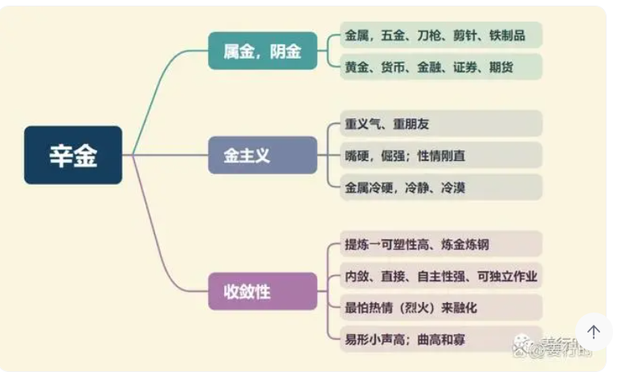

**最核心要点**

***1.辛金（阴金）***
1.武曲是金星又是财星，因此喜见禄星（禄存、化禄）来相会，增加财运与生财能力；其次喜坐财帛宫与田宅宫并见吉星，主生财能力佳；武曲星还喜居“辰戌丑未”四宫，原因有两点：（1）庙旺；（2）可增加收敛性。
2.金主义，讲义气，重朋友，但对自家人却容易不讲情面，直来直往，入六亲宫位时对应的人讲话有点刀子嘴。
3.金有收敛性，所以武曲主人内敛，可塑性强，但须要 （1）花时间 （2）提炼纯度。属金的（武曲、七杀）一般小时候较沉静，到青少年时期，容易有所变化。

***2.化气为财、财帛主***
1.武曲、天府、太阴均是财星，但特性却有所不同：
武曲是行动力、执行之财（经营、投资），所以会积极赚钱，也主财路的宽广，喜欢拿钱去投资。
天府为财库之星，有保守、守成的特性，喜欢将钱存在银行，生活上花费到一定程度（会设置上限）后会开始管控支出，所以天府也跟预算有关。
太阴化气为富，太阴以月亮来代表，月亮有东升西落的转动特性，且月亮会横跨各个国家，因此月亮主远方之财。

2.财星一般喜入财帛宫和田宅宫；其次财星不论坐何宫，均可主该宫得财或失财。

3.武曲与太阴为暗合关系，做个比喻，武曲出去赚钱之后，把钱交给老婆（或母亲）来管账；又可以理解为，武曲赚了钱之后会置产（太阴也为田宅主）来聚财。

***3.寡宿星***
“男怕孤，女怕寡”，武曲星对坐命宫或夫妻宫的女命较不宜，易有妻夺夫权或因财起争执的情况。若女命的命宫或夫妻宫有武曲星，建议有自己的事业，做职业女性，因为一般争执起因多来自金钱问题而非感情问题，例如嫌配偶赚得少或花太多，女性有独立的经济基础，会减少这类问题的杀伤力。除此之外，若遇羊陀或武曲化忌，切记不要过于刚直、强势，适当的多些温柔和情趣。
武曲不喜再见孤辰、寡宿二星同度或相会，会增添孤寡特性。

***4.将星***
武曲星为将星，因此除了金融业外，也很适合一些武职行业，例如军警、医生、工程师等。一般武职之人行动力强，可独当一面，所以除军警界外，自由业也很适合武曲。
将星喜见主实力、机缘、贵人的星曜，这样才有机会被看到、被提拔，因此喜见天魁天钺（贵人星，主机会）双星，其次是左辅右弼（实力、主左右手）。

**武曲星入十二宫**

***命宫***
个性刚直，执行力强，独立性强，重视钱财，有财运会赚钱，也会花钱。

化禄 — 为正财，有赚钱头脑，从商者可大吉大利、大富大贵
化权 — 有独当一面、独挑大梁之才华，因此往武职方面发展最合适
化科 — 具文学素养，如果往文学方面发展、研究，可望功成名就
化忌 — 易横生枝节，产生不顺的影响

***兄弟宫***
主男丁不旺或家中兄弟姐妹人数不多，兄弟姐妹个性多刚强。逢吉，可因兄弟或好友得财，逢煞，易因兄弟或朋友失财，逢煞另主兄弟不合甚至夭折。

化禄 — 兄弟个性强，大方，会赚钱
化权 — 兄弟喜掌权，有主见，凡事自己拿主意
化科 — 会得到兄弟帮助，互为贵人，因为有科的影响，会软化武曲的刚硬
化忌 — 兄弟个性固执，重视金钱

***夫妻宫***
期望配偶家世好或能理财，配偶个性刚强，重视事业。逢吉，主配偶带财运；逢煞，易见刑克或配偶散财。若加羊陀主争吵，若遇截空、空劫、化忌，夫妻关系比较冷漠。无论男女，都以晚婚为吉。

化禄 — 配偶个性强，能力高，甚至有钱
化权 — 配偶强势强硬
化科 — 配偶能力强还比较体贴，婚姻关系较好
化忌 — 对感情过于执着强势，恐会因金钱争执

***子女宫***
主生女，男丁少或晚得。子女个性好强、有自己的主见。逢吉，重视钱财也吝啬；逢煞，易体弱多病或不重金钱，另主花钱得子（试管）。

化禄 — 子女聪明倔强，有生意头脑，可能有钱
化权 — 子女个性正直刚强，相当有主见
化科 — 主子女有经济概念，个性较前者好
化忌 — 主子女个性固执，难以沟通；也有可能主命造溺爱孩子

***财帛宫***
武曲为财帛主，入财帛宫得位，财富格局好。喜投资或投机，喜欢钱滚钱。逢吉，可投资获利、宜金融业，逢煞，钱财易见损耗，或投资失利。

化禄 — 一生不缺钱财，赚钱有一套，容易轻松入财
化权 — 财势旺，闹中取财，能掌控金钱进出
化科 — 财名两利，安稳可守，若中年发达，可守一生
化忌 — 更爱财，收入不会中断，一切只为赚钱

***疾厄宫***
疾厄宫代表内心，内心爱钱；健康上主肺、呼吸系统。

化禄 — 比较能控制自己的脾气
化权 — 身体强健、好动，骨子里个性硬，抗打击能力强
化科 — 身体不错，科能解厄
化忌 — 主身体差，尤其肺部、呼吸道、过敏（含皮肤过敏）

***迁移宫***
财在远方，为钱奔波。武曲会吉星，如禄马交驰在迁移，为巨商之格。武曲主动、好争强，所以变动性大，在迁移宫难免奔波操劳，劳心劳力，也算劳有所得。
化禄或禄存+天马，即为禄马交驰，没有武曲也可以越跑动越有钱。

化禄 — 在外大方，容易出外赚到钱
化权 — 出外得权且有钱可赚，在家无权
化科 — 出外有贵人扶助，尤其在钱的方面
化忌 — 不得不出外，出外较辛苦，要靠自己

***交友宫***
朋友较有钱，执行力强。只要不会煞忌，虽朋友流动率高，但也能得其助力，朋友很多，各路英雄好汉（各阶层）都有。

化禄 — 朋友有钱，大方
化权 — 易交到金融商界朋友，或有权力地位的朋友
化科 — 易交到有名望，有钱的朋友，与朋友互为贵人
化忌 — 易借朋友钱，与朋友尽可能不要有金钱往来，防因友损财

***官禄宫***
易花大钱在学业上或事业上，以财求官。

化禄 — 指工作或事业金钱流动顺遂，可从事与金融有关的职业或事业
化权 — 指掌财权，尤其在军警界或金融业可为主管
化科 — 宜武职或金融业
化忌 — 工作敬业、认真，但在生意上要注意资金周转问题

***田宅宫***
堆金砌玉，家里有钱、聚财。逢吉，可因不动产致富，可得祖业；逢煞，易投资不动产失利，或因投资失败而变卖家产。武曲有大的意思，因此住大房子为合局，易住军警旁或金融机构旁。逢煞，住在市场旁边。

化禄 — 武曲喜化禄入田宅，家业守得住，当有钱人机会高
化权 — 住大房子，且家中风水可能带财
化科 — 喜在家，也较易存钱，所买之房可能不大，类似公寓，但布置雅致温馨
化忌 — 喜存钱，也喜在家，在库位容易存钱

***福德宫***
武曲在福德宫，兴趣是钱，对钱特别敏感。逢吉，可靠智慧赚钱或投资获利；逢煞，为财辛劳。

化禄 — 爱钱，赚钱容易，福禄大
化权 — 掌财权，注重享受
化科 — 主晚年掌财，会照顾子女
化忌 — 爱钱，但也容易花钱，重享受

***父母宫***
父母易经商或军警、医学界，父母个性刚直，有威严，对财重视。逢吉，可因父母（长辈）得财；逢煞，可因父母（长辈）失财。

化禄 — 主父母会赚钱，父母可能有钱
化权 — 主父母掌财权，有主见，个性严肃，脾气刚硬
化科 — 主父母身份地位高，个性较保守谨慎
化忌 — 主父母脾气固执、顽固

**武曲星喜忌组合**
1.武曲见禄星（禄存与化禄）一般可主容易掌控钱财，因其将星属性有掌控的特质，再遇天马可使金钱流通，所以更喜“禄马交驰”，主“发财远郡”，表示可到外地发展或投资外地产业或不动产。

2.武曲见科甲星易为金融业，古书云，“武曲魁钺居庙旺，财赋之官”。

3.武曲喜见吉星，又见红鸾、天姚，主可因异性生财（得财）。红鸾、天姚除桃花星外，红鸾还有科甲、喜庆的特质，天姚有才艺、才华的特质。

4.武曲逢煞星多又见咸池、大耗、哭虚，主因酒色赌败家。

5.“铃昌陀武” 是指此四星于三合及对宫聚齐，此组合意味着可能因自己一意孤行造成倾倒、决裂、心灰意冷。

6.武曲星为北斗星，且三合永远会见紫微、廉贞，因此先天受紫微与廉贞（均为官禄主）影响，及自身为财星的缘故，一生热衷赚钱。

7.武曲星主经营、行动、当下之财，太阴星主意念、远方、未来之财，若两星所在的宫位均有吉星同宫，则为互权，即两宫有相互协助之意，若一宫吉一宫凶，则会互相牵制。

**武曲星组合变化(入命)**

***武曲天府子午宫：对宫七杀、三合紫微天相及廉贞***
***武曲七杀卯酉宫：对宫天府、三合紫微破军及廉贞贪狼***
1.武曲天府表达力强，有生意头脑，精明能干，讲究规矩，为人小心谨慎，不惹是非，行为保守，重物质。
2.武曲天府在子午宫，可谓之“财与天府同宫有寿”，但是需要不见煞星（羊陀、火铃、空劫、武曲化忌）才行。其三合紫微天相及廉贞，是偏向稳定的组合，不过，武曲是执行、行动的星，而天府是保守、稳重的星，所以两星同宫易有犹豫、谨慎特质。
3.武曲为财帛主，天府为财帛主+田宅主，此二星都是财星，所以一生多与财务事宜有关，比如财务经理、会计、出纳、税务局、银行等等，最不喜遇见空劫、大耗、化忌，易见耗财的事。
4.古文云“武府禄巨富”（武曲+天府+禄存，指同宫），多指储蓄成富或继承而富；“武府羊巨商”（同宫），这是因擎羊的冲拼特质，突破原武曲天府保守现象，变得交易冲拼，积极赚钱，钻研生财之道，因此大多会从商，火星、铃星次之。
5.武曲七杀个性刚强顽固，做事斩钉截铁，不认输，好胜心强，思想很直接不会转弯，敢爱敢恨，爱恨分明。
6.卯酉武杀多属动荡及刑伤，一般宜武职或技术才可趋吉避凶。其次二星都是金星，刚直特质非常明显，所以三方与对宫非常重要。三合紫破属创意，动荡，廉贪属才艺、桃色，所以也可以从事工艺、工业或者持刀的行业，比如医生、军警等。

***武曲贪狼居丑未宫：对宫空宫、三合紫微七杀及廉贞破军***
***武曲独坐辰戌宫：对宫贪狼、三合紫微天府及廉贞天相***
1.武曲在辰戌宫独坐，武曲的特质较为明显（刚直），而武曲贪狼同都丑未宫时，因贪狼有交际应酬及圆滑的特性，可以让武曲的刚直变得稍微软化一些。
2.武贪组合有“武贪不发少年人”的说法，是个中年发达的命格，自信心强，为人勤快而劳心劳力，凡是靠自己不求人，通常以事业有无作为来衡量人生价值。
3.丑未宫的武曲贪狼，三合紫微七杀及廉贞破军，属动荡、波动性组合，所以“横发”特性比较大，风险也比较高。武贪同宫或对宫，其基本特质有“武职大利”的现象。
4.武曲独居辰戌宫，三合紫微天府及廉贞，是较为稳定的组合，因此稍微有些保守。
我们目前是单纯分析主星的组合，没有将副星考虑进来，所以有时动荡组合也会因副星同度或三合、对照而变得保守、谨慎。

***武曲天相居寅申宫：对宫破军、三合紫微及廉贞天府***
***武曲破军巳亥宫：对方天相、三合紫微贪狼及廉贞七杀***
1.武曲破军个性刚强，易冲动，喜掌权，成败起伏大，有孤注一掷而不计后果的冒险精神。
古书对破军星评价不高，所以古文云，“与破军同度，破祖丧家，而终身劳碌”，现今社会，武曲破军虽为动荡组合，却也仅仅表现在常常走动，聚少离多，不会像古文说的那么严重，武曲破军如有见禄星（禄存、化禄）仍是很不错的组合。
2.武曲为财，破军为耗，因此武曲破军组合可能会有耗材、财损的现象，此时需加看太阴天机（寅申宫）之吉凶再来判断。
3.武曲天相生活平稳物质不匮乏，做事情很会推脱，但投入后会全力以赴，有责任感及正义感，喜欢管闲事，但遇到压力又会退缩。
4.寅申宫武曲天相三合紫微及廉贞天府，两颗财星相会，所以一般多与财经界有关，或有掌权之事。另外武曲金与天相水同宫，刚直个性会因天相而有软化融合。若逢昌曲或桃花星，可增添才艺特质，然而相对也可能会带来感情困扰（犹豫）。