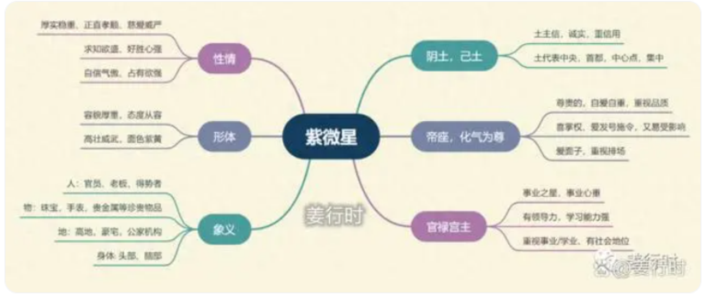
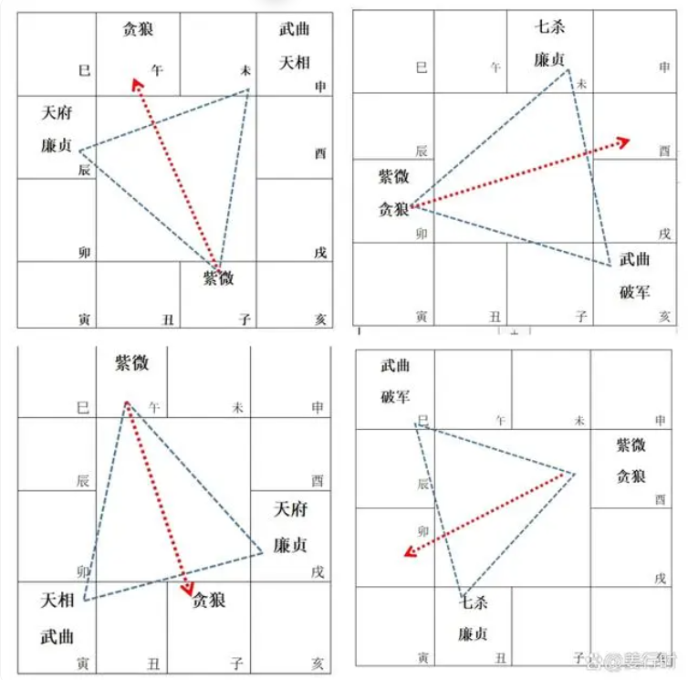
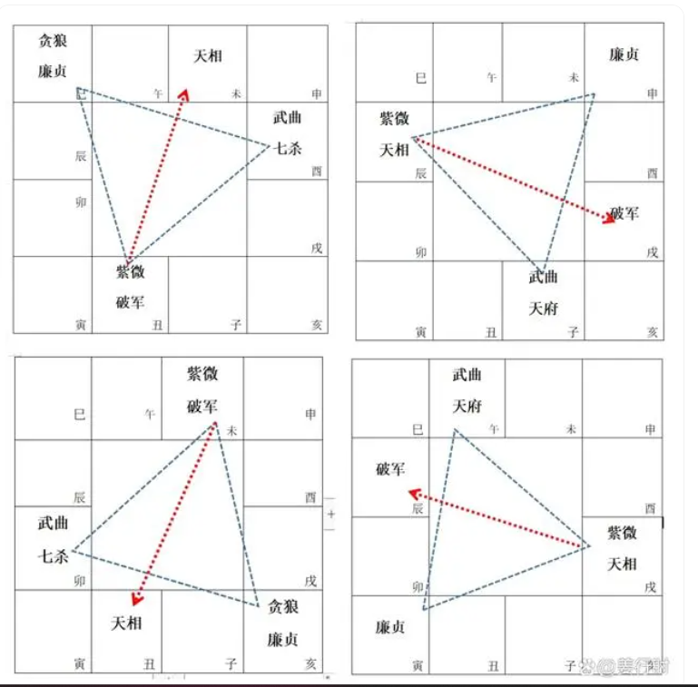
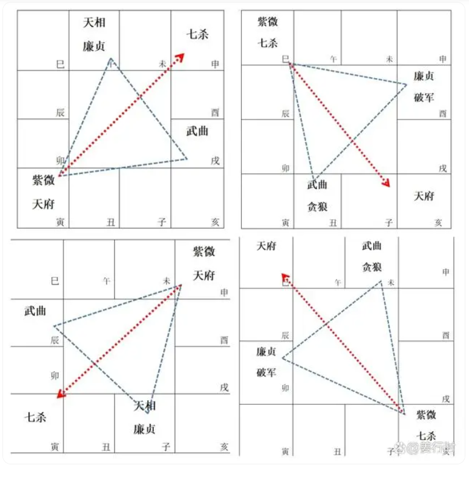

**最核心要点**
很多含义都是由此延伸的，在论各宫及流年大限行运时，都可代入这些重点来解读，大家慢慢体会。
***1.紫微属阴土，己土 —— 主信；中央；包容***
***2.为帝座 —— 皇帝，尊贵的；高的，高级品；喜遇贤臣（吉星）***
***3.化气为尊 —— 自尊心强；爱面子重排场；有地位***
***4.为官禄主 —— 事业心重，喜掌权，领导力强***
***5.解厄制化***

**紫微星喜忌**
1.紫微喜 ***左辅右弼同宫***，为其辅佐；喜与 ***天府同宫或会照（三方四正）***，为其国库、财库。

2.***天府、天相、左辅、右弼、文昌、文曲***都是他的部从，***天魁、天钺***是他的传令官，这些星聚合(方四正)或拱照(对宫)，叫做“君臣庆会”，是好的格局。

3.紫微星能 ***解厄制化***，紫微星之威能 ***制羊陀火铃的凶性（2颗以内）***，也能 ***化七杀为权***

4.紫微不喜 ***独坐***，独坐为孤军，没有贤臣辅佐，常出现外行去指导内行的情况。

5.紫微忌 ***遇煞星齐会（3颗及以上）***，紫微耳根轻，会听信谗言，成为昏君、暴君。

**紫薇四化**
紫微星只会化权、化科

**紫薇入十二宫**

***命宫***
温和敦厚、举止高雅，待人谦恭有礼，做事小心谨慎，从容不迫。拥有强烈的好奇心和卓越的管理能力。
个性方面，骄傲，喜掌权，爱发号施令，耳根较软；爱结交权贵，喜欢奉承（或被奉承）。紫微坐命的人求职或创业都容易有不错的成绩，如果从事与文章有关的行业更佳。

紫微化权坐命：主能力强、大权在握，若会左辅右弼，权势更盛。
紫微化科坐命：主贵人，此科能解厄制化，紫微入身宫也能解厄。

***兄弟宫***
兄弟中有显贵，可以倚靠，无论是物质方面或精神方面都有兄弟来帮助；父母较听从兄弟的话。

紫微化权入兄弟宫：主兄弟有权威。
紫微化科入兄弟宫：主与兄弟互为贵人，兄弟为保守、谨慎，具有非凡气质的人。

***夫妻宫***
主择偶眼光较高，期望配偶事业有成或家世好。易晚婚（因为要求高），也易因学业或事业而忽略感情运。男得贤妻，女因夫贵，前提是紫微独坐且无煞忌冲，紫微星独坐以晚婚为吉。

紫微化权入夫妻宫：主配偶有实权，有两个倾向，1.自己得听对方的；2.择偶时偏向于自己选择的配偶，不太会听别人的意见。
紫微化科入夫妻宫：主配偶体贴，贤良温顺。

***子女宫***
望子成龙（凤），对子女期望高；子女自尊心比较强，同时也会拥有优秀的子女；子女才能奇特，有特殊的感应力，但子女也可能并不多。

紫微化权入子女宫：主子女喜欢掌权，自己可能干涉不了他，他有自己的主张，甚至家长得听他的。
紫微化科入子女宫：主生贵子，子女气质高，谨慎、保守、小心。

***财帛宫***
紫微星为帝王星，入财帛宫一生衣食无忧；紫微非财主，而是官禄主，不会为五斗米折腰，要赚尊贵的钱，求财方面比较爱面子，也可能高消费；以官求财或创业。

紫微化权入财帛宫：掌财有方，理财有术；可能具有大师级的专业技术。
紫微化科入财帛宫：掌管的财帛可能为公家之财（例如就职于国税局、财政局），可安稳度日；主贵人。

***疾厄宫***
紫微属阴土，主脾胃病、寒弱湿热膨胀、下泄呕吐等症状（非长期性的疾病），尤其化权在疾厄宫者，注意饮食，易引发脾胃之症。
又主头部、脑部，如与其他凶星会合（四煞星：羊陀火铃），常有头部之灾，导致脑部受伤。晚年要注意高血压、富贵病。紫微星入疾厄宫之人，通常一生较少病痛。

紫微化权入疾厄宫：较好动，闲不下来，以致于过度操劳。
紫微化科入疾厄宫：身体健康，纵有灾病，定有贵人解救。

***迁移宫***
人缘好，出外遇贵人，得到的助力多，容易得到长辈提拔；本身的行为举止、谈吐表现也很出众，交际场合表现活跃。

紫微化权入迁移宫：外出得权，易掌权，可名利双收。
紫微化科入迁移宫：外出得贵，受扶持，可能名高过利。

***交友宫***
在人际关系中交往的朋友层次高，遇吉时可依靠他人而得名，不然略有逢迎之累。

紫微化权入交友宫:容易交到有权力地位的朋友。
紫微化科入交友宫：容易交到气质优雅的朋友。

***官禄宫***
紫微星是官禄主，所以紫微入官禄宫为得位，最吉。主事业心重，主管格。
一生事业平稳，可以平步青云，但需要有左辅右弼相扶，格局才大。领导能力强，经常是公司里的高阶主管。紫微适合的行业有学者、教授、工程师、政界、民营企业主管等。

紫微化权入官禄宫：可掌实权，格局较大，升迁机会大。
紫微化科入官禄宫：宜公职，若创业适合做与公家有关的生意。

***田宅宫***
住在高级住宅区或高楼、高地，或者公家机关旁边。

紫微化权入田宅宫：家中宽敞气派。
紫微化科入田宅宫：家庭布置高贵高雅，不一定大。

***福德宫***
有涵养，品味高，穿衣打扮和消费都有一定的水准。

紫微化权入福德宫：比较有主见，喜欢排场，高消费。
紫微化科入福德宫：兴趣高雅，花费谨慎。

***父母宫***
父亲社会地位较高，拥有自己的事业，在精神或物质方面可以很好的照顾自己；也因为父亲居高位，有些孤傲，父子/女间较刻板、严肃。幼年生活宽裕，环境比较优越。

紫微化权入父母宫：主父亲高贵，可得父母帮助，但也因为父亲权高，自己会受其制约，可能会影响自己的独立性。
紫微化科入父母宫：与父亲感情不错，父亲格高，谨慎重名，可能为公家机构或高级公司的主管。

**紫微星组合变化**

***紫微独坐子午宫：对宫贪狼、三合武曲天相及廉贞天府***
子午宫紫微独坐，紫微特质明显，三合武曲天相及廉贞天府，均为稳定星曜组合。
紫微是皇帝，皇帝需要财力库房（天府）及官印权势（天相），因此紫微喜见天府天相，可增强紫微气势，这是很不错的组合。对面子午宫的贪狼处旺位，贪狼的吉凶会影响紫微的外交、兴趣与桃花。

***紫微贪狼居卯酉宫：对宫空宫，三合武曲破军及廉贞七杀***
卯酉宫紫微因与贪狼同宫，受到贪狼影响，较会圆融、变通、交际，注重表面。其次三合武曲破军、廉贞七杀，这个组合比较动荡（因为七杀、破军、贪狼都是动荡的星曜）。
紫贪组合为人生活浪漫，喜欢娱乐享受（不只是酒色财气，也可能是打游戏、打球、看小说、刷剧等），活泼而热心，有专业性高的技术或爱好，理想多而不重实际，讨人喜欢，异性缘佳。

***紫微破军居丑未宫：对宫天相，三合武曲七杀及廉贞贪狼***
丑未宫紫微因与破军同宫增加了冲动和波折现象，同时也增加了拼搏精神，紫微破军会带领一群人向前冲。三合武曲七杀及廉贞贪狼，这三合的四颗星中多属落陷，增加了紫微破军的辛劳，唯有对宫天相遇吉可稍让其安定或减少波动。
紫破组合为人霸气，独来独往，不喜受人管束，社交手腕高，说话做事都很大胆，敢爱敢恨，勇往直前，不怕得罪人。他们不按牌理出牌，喜欢改革传统。

***紫微天相居辰戌宫：对宫破军、三合武曲天府及廉贞***
天相是紫微的随从，且为佐帝之星，因此辰戌宫紫微受天相的影响，没有紫破的冲劲儿，比较保守，且三合的武曲天府及廉贞也是稳定的组合，只有对宫破军的冲力会让紫微天相有机会突破原本保守的特质。前文说紫微破军会带领一群人向前冲，那么紫微天相就是叫一群人向前冲。紫微天相组合有忠厚正派的气质，有专业的技术，喜欢发号命令，常对上司或长官有意见（对宫破军影响），但守规矩，为人热心，喜欢帮助别人。

***紫微天府居寅申宫：对宫七杀、三合武曲及廉贞天相***
紫微天府居寅申宫较为稳定，紫微得天府同度、天相拱照很是安稳，若遇禄存星，则更佳。紫微天府组合物质生活富足，但精神较为空虚，理财能力佳，为人正派做事一板一眼，守信用，重视自己及家人的生活享受。

***紫微七杀居巳亥宫：对宫天府，三合武曲贪狼及廉贞破军***
巳亥宫紫微和七杀一为君，一为臣，君为臣纲，紫微可制七杀而化权，就像握有军权的皇帝，七杀可增加紫微的理智与权力，此组合更适合发展武职，武职在古代多为军职，现在可理解为军警及司法体系、管理、市场开拓、工商业等需要拼杀的职业。
紫微七杀组合外表沉静内心刚强，爱恨分明，性格很强悍，不喜欢反对意见，但会以理服人；有艺术天赋，耐力强。

**紫微星的强大影响力**
紫微星是排盘时第一颗排列的星曜，所以无论紫微坐落何宫，均主该宫与命造有密切的关系，尤其是与事业的成败有关。（例如，紫微坐夫妻宫，主该命造一生中，其夫妻感情好坏，会影响一生命格的高低，尤其是事业上。也可以理解为，该命造期望配偶（或配偶家族）对自身事业能有所帮助。）

一般来说，喜紫微入命、财、官等宫，对自身有利，因为可以戏称为“我做皇帝”，其他人是臣子；反之，若紫微落入兄弟、子女、交友等宫，他们做皇帝，那自己不就变成臣子了。

紫微坐落的宫位如果有吉星同宫，一般来说可透过该宫来获取事业。

