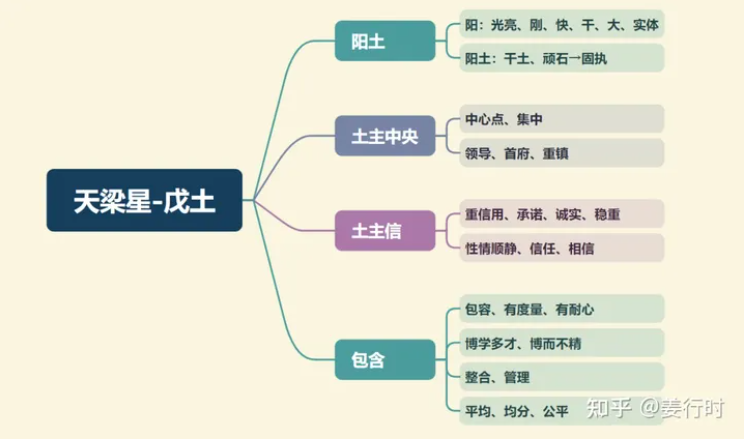

**最核心要点**

***1.戊土（阳土）***
1.天梁的阳土有重视“原则、道理、真理”的特性，所以天梁坐命之人，会认为自己是择“善”固执。

2.五行土与金水木火有相连性质，所以有包含（或涉及）的特质，因此天梁星逢吉，无煞无桃花，大多有度量、有耐心、喜讲公平、公正（尤其逢左辅右弼）；若逢煞或桃花，则易以自己喜好来讲公平或公正。

3.天梁是父母主，所以天梁有无见到太阳星是一个关键，因为天梁永见太阴（母星），但不一定会见到太阳（父星），当天梁“日月星”均见时，主有集中、授权之意，例如天梁居丑未、天梁居子午。

4.土主中央，所以在身体上大约为肚子的位置，而肚子位置里面的内脏为脾胃。面部的中央为鼻梁，所以天梁坐命之人，鼻梁若低陷或短小，则主意志薄弱、原则性低，反之，若鼻梁挺直或长直，一般主其深思熟虑、意志坚强。

***2.化气为荫***
1.荫者，有“庇荫”之意，所以天梁星坐命（身宫不是）之人，一生易得到“庇荫”，例如祖先庇荫、神明保佑。因此，若此命出生于“积善之家”，则命好（所以父母宫、田宅宫要好），其次是要常祭拜祖先。

2.“庇荫”也有“照顾、关照”之意，所以幼年易被大哥哥、大姐姐照顾，其次是被长辈照顾或关心；长大后喜好照顾别人，幼年时很有长辈缘。

3.天梁入身宫者，身宫为命造后天的宫位（命宫为先天的宫位），所以此庇荫为自己对子女（孙子）的庇荫，因此天梁坐身宫之人，其行为举止，对其子女的教化，非常有影响力。

4.天梁星重“辈分”“伦理”，比自己大，易尊重对方；比自己小，会照顾对方，但易唠叨。

5.天梁虽有“荫”的特性，然而因为其也是“父母主”，若天梁坐命宫，可以比喻其将父母宫的“守护神”抢过来自己用，所以一般天梁坐命之人大多不易与父母同住，但其具有孝心，也可说孝心是该命造的“价值观底线”—— 凡是对其父母有言行冲撞或是不礼貌的，会容易翻脸。

***3.为父母主***
1.天梁星为父母宫的父母主，可以说是父母宫的守护神，掌管此命造与父母冥冥之中的情谊（看不到的缘分）及与父母互动是否良好。

父母宫是观察自己与父母或长辈互动的“行为”，而父母主则是显现自己从小受父母、长辈教化的“信念”。

2.天梁主孝心、长辈缘分，其中的孝心、孝道是指心中对父母的尊重、重视，有可能命造虽未与父母同住，但父母一有事故时，该命造可能是第一个冲到现场，或愿意辞掉工作来照顾父母，尤其以天梁庙旺（或者不逢煞、桃花星）居命宫、父母宫、田宅宫三宫最为明显。

3.天梁坐命的“克星”就是“长辈、上司”不佳时，即父母宫凶，此时最怕不受上司重用，或遭长辈的朋友欺侮。所以天梁坐命之人，额头要高挺宽阔（长辈运佳），鼻梁要挺直有肉（不易被人左右）。

***4.司“寿禄”***
1.天梁为“老人星（长辈星）”，所以与长寿有关。然而长寿不等于健康，天梁陷位或天梁见煞曜（尤其有拖磨特性或慢性病的星曜），主带病延年。

2.天梁主寿，其三合必见太阴星，太阴为财星，化气为富，所以天梁本身先天就已具备“有财”的基本特性。只是太阴星的庙旺与否，对天梁有影响，且太阴星的亮度又受太阳的庙旺来影响，所以天梁星若能见太阳则更加可主“名利双收、富贵双全”，当然太阳、太阴要居庙旺才佳（太阳主贵、声名，太阴主富、财帛）。

3.天梁若遇天同三合或同度（对照不是），且太阴也居庙旺三合位，则可称为“福禄寿” 齐全（以不见桃花、煞曜的组合才是）。

4.一般天梁不喜见禄星（禄存、化禄）同度，因为天梁有统御能力，重名气不重物质（重名不重利），若逢禄星:

→反主有麻烦之事，或因处理麻烦而得财

→或易收贿或贪污，或因财惹祸。

**天梁星入十二宫**

***命宫***
主少年老成，成熟、稳重，经验多（多为吸收他人经验），易倚老卖老。逢吉→主孝，有长辈缘；逢煞→易愚孝或对父母不敬，或与父母有心结。

化禄:可解灾厄，又主福寿
化权:主喜掌权，喜管他人事，好打抱不平
化科:宜从事研究深奥理论之行业，行运逢之，可得长辈之助

***兄弟宫***
兄如父、姐如母，易受兄姐照顾，或自己需要照顾年幼之弟妹；另主结拜或忘年之交。逢煞→易受兄姐（或好友）拖累。

化禄：得兄弟姐妹的照顾，但易唠叨
化权：较听兄弟的话，也主兄弟口才好，爱打抱不平，愿意当老大
化科：较容易得到兄姐关心

***夫妻宫***
配偶若年长则荫己，若年幼则自己照顾对方；感情先逢凶后化吉，波折多。喜欢孝顺的，也期望配偶得到父母认同；另主姐弟恋。逢煞→宜与父母分居。

化禄：指配偶多荫，容易得配偶之助
化权：主配偶喜掌权，能说善道
化科：主配偶爱面子，会尊重另一半意见

***子女宫***
重视自身的言传身教，子女少年老成，有孝心，易早离乡求学（职）。

化禄：子女有长辈缘，性格大方
化权：子女自主力强，不需父母管
化科：对子女很贴心，注重面子

***财帛宫***
长辈给予或意外之财，可从事慈善事业、医疗、养老院、养生馆、运动器材等行业。

化禄：以宗教命理可得财，或房地产、照顾人之工作职业；或可靠长辈提携入财
化权：有可能以房地产得财，肯辛苦打拼而得财，辛劳可守，有长辈管束更能守财
化科：表稳定之财，会得长辈相助

***疾厄宫***
天梁为阳土，主脾、胃；遗传病（父母主），老人病、慢性病；天梁在疾厄宫可逢凶化吉，一生少病痛，天梁主中医，可看中医医治。

化禄：主长寿，身体健康，得长辈照顾
化权：较好动，操劳，可能喜健身；注意由于饮食不正常导致得脾胃问题
化科：主身体会得到长辈照顾；较无重大问题

***迁移宫***
在外有贵人，出外有庇荫，贵人是年长者；出外愉快，易离乡发展。逢煞→出外不顺；逢桃花→防因酒色出事。

化禄：出外应对得体，老成持重，但注意不要过于世故，倚老卖老
化权：主在外喜称老大，喜好做领导
化科：出外易有贵人提携，以年长者居多

***交友宫***
易得忘年之交，也多互相扶助和关爱；逢煞→损友多（背黑锅）

化禄：容易得到有钱朋友之助
化权：朋友中有掌权之人，但助益不如天梁化禄
化科：朋友中会有声名远播之人

***官禄宫***
事业稳定，宜慈善事业、教育事业、公益团体、医疗养老事业，也可做父母宫。

化禄：在工作上更容易得上司提拔
化权：管理能力足，霸道但讲道理
化科：主名望佳

***田宅宫***
家族易有长寿之人；主孝，父母与自身讲孝道，有祖业。逢煞→家宅是非多，长寿但多灾（疾）、家族病史、长辈多劳碌或愚孝。

化禄：住家宽敞，主家中成员相处愉快
化权：在家中喜掌权，或需承担家中事物
化科：住家不大，但风水平顺，可解厄，家中成员相处愉快；家中可能藏宗教文物

***福德宫***
家族易有长寿之人；主孝，父母与自身讲孝道，有祖业。逢煞→家宅是非多，长寿但多灾（疾）、家族病史、长辈多劳碌或愚孝。

化禄：住家宽敞，主家中成员相处愉快
化权：在家中喜掌权，或需承担家中事物
化科：住家不大，但风水平顺，可解厄，家中成员相处愉快；家中可能藏宗教文物

***父母宫***
主父母孝顺、善良、长寿，能与父母同住，也受福荫。

化禄:父母大方，能言善道，也很疼爱命主
化权：父母有权威，很敬畏父母
化科：主得父母照顾

**天梁星组合变化(入命)**

***天梁独坐子午宫：对宫太阳、三合太阴天机及天同***
***太阳天梁卯酉宫：对宫空宫、三合太阴及空宫***
1.天梁星居子午卯酉四宫，除酉宫不为庙旺之地，其余子午卯三宫位均为庙旺之地。

古文说，“天梁文昌居庙旺，位至台纲”，“曲遇梁星，位至台纲”，此三宫（子午卯）即已符合基本条件(天梁星庙旺)，此时若与文昌文曲同度或相会（昌曲均见更佳），更主才华横溢、气度不凡，若再见禄存（化禄也可，算非正统组合），则四星俱见（太阳、天梁、文昌、禄存）为“阳梁昌禄格”，古文说，“天梁太阳昌禄会，传胪第一名”（古代的状元）。

此格坐命的人，脑容量很大，吸收力、学习力特别强，可以放学回家天天玩，成绩仍然名列前茅，尤其是太阳在卯午两宫庙旺时，所以此命格的人很适合通过考试、学历来得到工作，例如：考公、考编、考专业证书等。

2.至于酉宫，太阳天梁双星均落陷，星曜力量不强，又加上太阴落陷在三合巳宫，此时会降低天梁的原则性，性格较易动摇或较负面；若逢煞星多（尤其天刑、羊陀、化忌），则易有诉讼，也主易有代人受过或背黑锅。

太阳天梁双星入命之人，为人热情大方，慷慨助人，正直刚强，言语直爽好相处，性格开朗大方不与人计较，是个金钱与地位并重的人。

***天梁独坐丑未宫：对宫天机、三合太阳及太阴***
***天机天梁辰戌宫：对宫空宫、三合太阴天同及空宫***
1.天梁星居辰戌丑未四宫，不是与天机星同度就是对照，一为“善”，一为“荫”，故有“善荫朝纲，仁慈之长”之意。

2.辰戌宫的天机天梁组合，古文注解较多，例如“机梁同在辰戌宫，加吉曜，富贵慈祥”，“机梁同辰戌，必有高艺随身”，都是说辰戌两宫遇吉星时的优点。而“机梁会合善谈兵，居戌亦为美论”说明辰宫较戌宫为佳，因为太阴为庙旺三合，且午宫（福德宫）易见太阳太阴庙旺来会照。

但若辰戌天机天梁见煞或空星，则反倒有“挑剔”“宗教”的特质，如古文所说，“机梁羊会，早有刑，晚见孤”，“机梁同照命身宫，偏宜僧道”。

天机天梁组合坐命之人心地善良，性情温和，品学兼优，自尊心高，待人有礼，大多数人有技艺在身。同时，天机星和天梁星都对神秘、神仙五术或信仰、信念感兴趣，喜让自己有独特见解。

3.丑未宫天梁三合太阳、太阴，当天梁能遇太阳星之时，就如同“父母”俱见，其次太阳的发光发热还可以让天梁星的特质或个性较为活泼明朗，再来又因太阳主贵，太阴主富，两对星彼此相会又三合入命，正所谓“富贵双全”，“日月并明”，若入福德宫也可。

***天梁天同寅申宫：对宫空宫、三合天机及太阴***
***天梁独坐巳亥宫：对宫天同、三合太阳太阴及空宫***
1.天梁坐落此四宫，巳亥落陷，缺点较多，其中“顽固、挑剔”的特性会更明显。

天梁是一颗重原则、讲公平及道德观重的星曜，当居陷位之时，其原则性、公平性、道德观将会动摇或私心较重，此时不宜再见浮动星（天马、空星、地劫、哭虚、大耗）。天梁陷位最不喜见羊陀，再遇桃花星（天姚、咸池、鸾喜），易有酒色赌之事。

2.天同天梁居寅申宫是机月同梁格的组合（“机月同梁格”天机星篇已介绍），寅宫天同天梁为庙旺位，较为吉利，而申宫的组合却是天同旺位、天梁落陷，因此天同天梁居寅宫比申宫为佳，天梁陷位易先遇灾难再逢凶化吉。另外，此二星同度易有游走法律或道德边缘的现象，因为天同崇尚自由，而天梁却是讲原则、不徇私，所以有时会让此组合坐命的人很困扰。