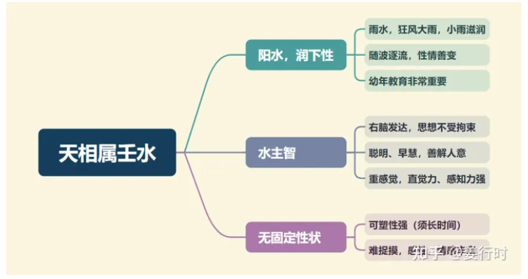

**最核心要点**

***1.壬水（阳水）***
“阳”有“看的到、阳刚、强硬、直、大”等特性，而“水”一般来说是“无固定形状”，且水的温度会随着太阳的照射而改变，阳水主星正曜有天同和天相，两星虽同为阳水属性，但因父母宫的主星正曜不同，也产生不同的变化。

水星一般主右脑发达、重视情绪、感受，“阳水”则有“显现于外”的特性，且学习、思考模式多属直线思考，因此天同易有“单纯、无知”特性，而天相则有“直言不讳”的特性。

***2.化气为印***
1.若把紫微比喻为皇帝，天府是财务大臣，天相则是文职宰相，掌管皇帝的官印（玉玺）与文书处理。古代的官印大多是正四方形，表示稳重、平定四方，因此天相坐命之人，处事有棱有角、重原则（可能受父母宫天梁的影响），守规矩，有正义感。

2.“印”在日常生活里可以联想到的相关事项或词句有：官印、影印、文书、印象、心心相印。

官印：古代的官印大多是正四方形，有棱有角的，表示处事作风有原则、讲规矩；也表公务、公职或掌印，也主掌权，因此喜见化权、左辅右弼、禄存。

文书：官章（印）一般都盖在公文及证书上，比如毕业证书、执照，一般天相坐命宫（官禄宫次之）的人，学历高低会影响成就高低，执照也算。

影印：可以联想到“复制”的特质，与“印刷”有关的事物。

印象：与回忆有关，念旧，优点是重感情，缺点是易活在过去式。

心心相印：与缘分、默契有关。

***3.天相星为“司爵禄”之星（衣禄之神）***
1.“爵”在古代为官位，延伸现代社会即有“公职、政治、地方官”之意，也是与“为民服务”有关的行业。
“禄”与“俸禄、食禄”有关，在现代可延伸为固定收入（薪水）。

2.天相与天府永居三合位，天相为官禄主，重名大于重利，天府为财帛主，则是重利大于重名，因此天相比较重视形象、外表、衣着；天府与天相虽均为“佐帝之星”，且天相为官禄主，但天府却有“南斗王”的特性，因此比天相多了一些霸气，而天相有“宰相、二位”特性，因此大多数时候很懂得“老二哲学”。

3.天相星喜“美食美服”，对吃、穿比较讲究，天相和天府一样有“口福”或“挑食”的情形，唯一不同的是，天相对喝酒的品味比天府高，因为天相为“阳水”之故。

4.天相喜见禄星（禄存、化禄），可增添“食禄”的丰富或稳定；更喜见“禄马交驰”，因为天相与天府一样为稳定性的星曜，若见“禄马交驰”，可增添事业的活络与收入的增加。

***4.官禄主***
1.天相为官禄主，掌管命造官禄宫的选择、判断，因此天相不论坐落何宫位，均主该宫位能影响自身对事业的判断和选择机，所以天相居命宫、夫妻宫、官禄宫的人，尤其要注意是否选对时机、选对行业、选对配偶。

2.天相虽掌官印，但不一定有执行的能力或权力，因为天相乃是“佐帝之星”，一般情形下，有时天相只是负责“宣布、公布”而已，因此天相喜见化权、左辅右弼、化科等星曜，来增添其“决断性”与“执行力”。

3.天相主选择、判断，所以除了学历、经历对其判断有影响之外，周遭环境的人事物也会有影响，因此天相的左右邻宫，有无“吉星夹、凶星夹”的组合，会左右天相的选择。中州派陆斌兆前辈曾强调，天相星除了有“吉凶夹”之外，另有“刑忌夹印”、“财荫夹印”两种组合（下文详述）。

**天相星入十二宫**
天相不四化，但可视同化科（保守、谨慎、小心）

***命宫***
为人敦厚，性情温和，待人诚实，行事小心有正义感，做事按部就班，有原则，记忆力好，念旧。逢吉→学历高或事业顺心；逢煞→易选错行或嫁错郎。

***兄弟宫***
兄友弟恭，可因兄友成事；逢吉→可合伙；逢煞→不宜合伙

***夫妻宫***
天相临夫妻宫的男女，结婚的对象大半是同学、同事或由介绍得来；讲求缘分或媒妁之言或亲上加亲。

***子女宫***
子女聪明正直，有口福，爱漂亮；易有两个子女。

***财帛宫***
用钱小心，稳定谨慎，财路安稳；逢吉→宜金融业或教师、律师；逢煞→易因官失财或辛劳得财。

***疾厄宫***
天相属阳水，主膀胱、肾脏、皮肤；天相可以视同化科，入疾厄宫主毛病不多。

***迁移宫***
人缘好，到处受欢迎，常有人跟随左右，爱管闲事；逢吉→出外愉快，离乡发展；逢煞→出外不顺。

***交友宫***
朋友懂打扮好美食，比较规矩、谨慎；逢吉→因友或下属成事；逢煞→因友或下属败事。

***官禄宫***
官禄主入正位，代表事业掌印，会有地位，稳定少变；逢吉→事业顺心；逢煞→辛劳或技艺为生。

***田宅宫***
有祖产可依，若能劳费心力可累积田产；若逢煞忌，房地产有文书证件的麻烦，防因担保或事业卖田产。

***福德宫***
喜欢美食、华服；喜欢安静，享受有节制、有水准。

***父母宫***
拥有明理的父母，可从父母的教导中得到一些为人处世的技巧；逢吉→父母成就高、感情好；逢煞→父母事业易遇失败。

**天相星组合变化(入命)**

***天相廉贞子午宫：对宫破军、三合紫微天府及武曲***
***天相独坐卯酉宫：对宫廉贞破军、三合天府及空宫***
1.古书说，“（天相）佐日月之光，兼化廉贞之恶”，即是说天相星与廉贞同度时，天相星可化解廉贞的“狂傲不拘”。
子午宫天相与廉贞同宫，三合紫府与武曲，为稳定性组合，而且天相与廉贞均为官禄主，廉贞掌事业拼冲力，而天相掌选择与判断力，因此天相廉贞坐命的人事业心重或多能在事业上有所表现，多为内勤或文教机构，或者财经界发展。
卯酉宫天相独坐，对宫廉贞破军，这里要注意，作为次桃花的廉贞星与水星同度（破军阴水），因此产生微妙的组合，天相主印、主缘，破军主耗、司祸福，所以子午卯酉四宫天相廉贞组合，情感上与情绪的收发，会因所遇的吉星凶星而有所影响。
廉贞天相坐命的人，为人心地善良，智慧高，聪明多才，喜掌权，有领导能力，处事谨慎保守，人生价值观偏重于明哲保身。

2.前文已经提到，天相星需要注意“夹宫”，尤其入命宫时更须注意。中州派陆斌兆老师曾补充天相星两个组合“财荫夹印”、“刑忌夹印”：
“财荫夹印”：天相星左右两宫分别为天梁星（荫星）与巨门星，当巨门星本身化禄（或同度的主星有化禄），则称为“财荫夹印”，主吉，有助力。
“刑忌夹印”：天相星左右两宫分别为天梁星（有刑的特质）与巨门星，当巨门星本身化忌（或同度的星曜化忌），则称为“刑忌夹印”，主有压力、受牵制，也可说被某些事物绑住或考虑因素太多。

***天相独坐丑未宫：对宫紫微破军、三合天府及空宫***
***紫微天相辰戌宫：对宫破军、三合天府武曲及廉贞***
1.天相独坐之时（丑未、卯酉、巳亥），则需留意命身宫以及夫妻宫、福德宫组合，因为天相坐命宫之人，夫妻宫一定是贪狼星，福德宫一定有七杀星，若命身宫有桃花星同度，则主自身易有感情困扰，若夫妻宫有桃花星，则多属因配偶引起感情困扰。

2.辰戌宫紫微天相同度，天相是紫微的随从，且为佐帝之星，因此紫微受天相的影响，比较保守，且三合的天府武曲及廉贞也是稳定的组合，只有对宫破军的冲力会让紫微天相有机会突破原本保守的特质。
紫微天相组合坐命有忠厚正派的气质，有专业的技术，喜欢发号命令，常对上司或长官有意见（对宫破军影响），但守规矩，为人热心，喜欢帮助别人。

***天相武曲寅申宫：对宫破军、三合紫微及天府廉贞***
***天相独坐巳亥宫：对宫武曲破军、三合天府及空宫***
1.天相居寅申巳亥最不喜昌曲同度，除了天相本身不喜昌曲之外（尤其女命），武曲星的特质（刚直）也与昌曲星（才艺、情趣）不太合，易增加武曲优柔寡断的现象。
寅申宫武曲天相三合紫微及廉贞天府，两颗财星相会，所以一般多与财经界有关，或有掌权之事。另外武曲金与天相水同宫，刚直个性会因天相而有软化融合。
武曲天相生活平稳物质不匮乏，做事情很会推脱，但投入后会全力以赴，有责任感及正义感，喜欢管闲事，但遇到压力又会退缩。

2.天相独坐巳亥宫，对宫武曲破军，武曲为财，破军为耗，因此武曲破军组合可能会有耗材、财损的现象，此时需加看三合天府星之吉凶，以及寅申宫的太阴天机再来判断，以及，武曲破军如果有见禄星（禄存、化禄）仍然是不错的组合。