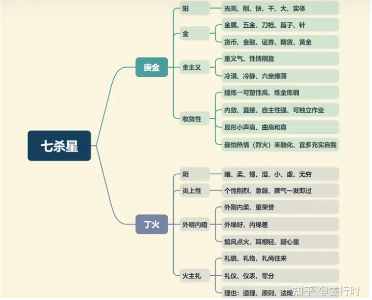

**最核心要点**

***1.庚金丁火***
1.七杀星为双五行，“庚金”显于外，“丁火”藏于内。七杀与武曲同为金星，五行中的“金”除有金银财宝之意，也有刀枪、钢铁之意，武曲星虽为“将星”，因其还是“财帛主”，偏向“财”的意味较重，而七杀是“将星”，也是“帅星”，所以更多偏向刀枪、钢铁。

2.凡金星若为“秋天生人”（秋天金旺），则个性较为冷静，缺点是女性身体较“冷”；若为“夏天生人”（夏天火旺），则个性上较冲动。

3.“金”本身有“收敛性”，因此个性易有内敛性（不是内向），这种内敛性使其个性冷静、刚强，有独立性，可独当一面。然而金属需要通过锻造才能提高纯度与价值，需要栽培和历练，因此重“贵人运”或“贵人星”（魁钺）。

4.除"阳金“外，七杀星还有“阴火”特性，另有一颗“阴火”星曜就是廉贞星。廉贞的“阴火、次桃花”与血液、精神有关，而七杀的“阴火、肃杀”则与刑伤有关，所以七杀或廉贞见煞曜时，廉贞容易带有一些感情纠结（例如人情世故、亲情），而七杀则比较有壮士断腕的快刀斩乱麻之象。

***2.在数为“帅”，为“斗中之上将”***
1.此处的“帅”是指古时“元帅”的特性：运筹帷幄、谋定而后动，为人冷静、喜思考计划，胆大心细，喜冒险（开拓疆土）、执行力强，也因其三合永为“破军、贪狼”，故喜变化或易变动。若以态度来说，七杀处事喜干净利落、速战速决，不喜拖拉。

2.古文说七杀星，“乃斗中之上将，成败之孤辰，在斗司斗柄，主于风宪”，这句话有说到一个重点“斗柄”。

“斗柄”是指“南斗七星”的形状，像一个舀水的瓢，而七杀星为南斗第六颗星，位置约在瓢的握柄处，因此称之为“斗柄”，意指七杀容易有"握柄、握拳（权力）”的现象，即为掌权之意。

另外“握柄”又可延伸为“持刀”→屠宰业、外科医生，尤其是与廉贞同度，廉贞主胆大，七杀主心细。

3.“将”与“帅”均为边疆防御的“武官”，表示七杀星很适合“武职"。不论是“将”或“帅”，易因忙于学业或事业而忽略配偶。

4.七杀喜见“稳定星曜”，尤其禄存、左辅右弼，因为元帅出征，需要粮草兵马，禄存可主粮草充足，见左右可主有得力助手、兵马充足。

5.若仅见文昌文曲而不见左辅右弼，容易使七杀多犹疑，有点像武将带文官去打仗，或文官带兵出征。

6.七杀喜见紫微同度或会照，又见吉曜，可主有“生杀之权”，吉曜指权力星（左右、化禄化权）、稳定星（禄存）、贵人星（魁钺）。

***3.为成败之孤辰***
1.七杀星成也“孤辰”，败也“孤辰”，那“孤辰”到底是指什么？

是指七杀星坐命身宫之人，易有“过度主观”、“自以为是（坚持己见）”或“不喜欢欠人情”、“孤僻性”等等人格特性。七杀就是因为有这样的人格特性（坚持），所以可以说“成也坚持、败也坚持”，不论这坚持是对或错，七杀都能甘之如饴。

七杀见吉曜、煞曜，对其坚持的成败，有加分、减分的效果，尤其要看七杀有没有见“稳定星曜”或“贵人星”，因为七杀若无实力、能力，又无贵人提携的机运，那么坚持到最后，破败的几率大。但七杀有不服输的个性，也可以说是不认命，也易有东山再起的念头或作为，至于是否真能东山再起，除了先天的命局之外，也要配合大运、流年的机运。

2.男怕孤、女怕寡，若七杀又见不利感情的星曜，例如“孤克星”或四煞、化忌、空劫，则一生婚姻容易不顺，尤其“夫妻宫”又有凶煞星坐守。

***4.主肃杀***
1.“肃"联想到“严肃”“肃静”→个性不苟言笑，冷酷型，容易认真而忘我，有时要求完美而忽略实效性。

2."杀气"→一般指带有“杀气”的行业：军警界、杀手、屠宰业、医生、法官等等。

3.七杀星与天梁星在古文中都有被提及是“主风宪”→与法律、司法单位有关，若再逢“天刑、羊刃”，多主官讼、是非或血光之灾，因此七杀星也有“刑”的特质→刑法、刑伤。

4.七杀星“运筹帷幄”，有“设计”的天分，可走研发路线，尤其是工业，因七杀属金。

**七杀星入十二宫**
*七杀不四化，但若与文昌同宫，辛年会随文昌化忌。

***命宫***
个性直爽、胆大心细、喜思考，处事干净利落，好胜，独立。逢煞→易一意孤行、六亲缘薄。

***兄弟宫***
主孤，兄弟姐妹不多，尤其是兄弟。逢吉→独立有成就；逢煞→波折多，易交损友或军警界之友。

***夫妻宫***
感情冲动，行动派的爱情，配偶个性强烈，感情易变。逢吉→宜晚婚，宜有独立的空间；逢煞→姻缘薄或所托非人，亦主配偶灾多或病。

***子女宫***
子女好动、个性刚烈，脾气硬；若女命，则不易孕。

***财帛宫***
易掌财权或从事财务方面工作，可从事重工业、军警、技术、医疗或自由业。逢煞→财不易守，忌投机或一意孤行。

***疾厄宫***
主筋骨、肺、鼻、外伤，女命不易怀孕（冷身）

***迁移宫***
逢吉（尤其逢禄）→出外发展得利；逢煞→辛劳多灾、易见外伤或骨折。

***交友宫***
朋友不多；逢煞→易受下属拖累、不宜合伙，宜多交军警或医疗之友。

***官禄宫***
主成败起伏、变动大，宜从事变动性大、具威武性的职业，如军警、技术、重工业、医疗行业。逢吉→可掌权；逢煞→多成败，多辛劳。

***田宅宫***
七杀居田宅宫，家中气氛不安宁，田宅得失变动性大；宜近军警或医院附近。逢吉→有田产；逢煞→祖业不守、家中易有伤残或孤独之人。

***福德宫***
主操劳、急躁，闲不住，喜冒险。逢吉→劳而有获；逢煞→劳而无获、感情或财运易不顺。

***父母宫***
父母个性刚直，不喜子女依赖，易缘薄或不在身边。

**七杀星组合变化(入命)**

***七杀独坐子午宫：对宫天府武曲、三合破军及贪狼***
***七杀武曲卯酉宫：对宫天府、三合廉贞贪狼及紫微破军***
天府星为守成、保守的星，七杀星是冲锋陷阵的元帅，一个守一个攻，两星相对是构成矛盾还是互补，要看是否见禄星，尤其是两星均见禄星为佳，七杀见禄存可增强其原则性与稳重。

武曲七杀个性刚强顽固，做事斩钉截铁，不认输，好胜心强，思想很直接不会转弯，敢爱敢恨，爱恨分明。

卯酉武杀多属动荡及刑伤，一般宜武职或技术才可趋吉避凶。其次二星都是金星，刚直特质非常明显，所以三方与对宫非常重要。三合紫破属创意、动荡，廉贪属才艺、桃色，所以也可以从事工艺、工业或者持刀的行业，比如医生、军警等。

***七杀廉贞丑未宫：对宫天府、三合武曲破军及紫微贪狼***
***七杀独坐辰戌宫：对宫廉贞天府、三合贪狼及破军***
丑未宫廉贞七杀，对宫天府三合紫微贪狼与武曲破军，属于动荡星组合，此组合有慢慢累积之意。七杀属金火，主刀、专注，廉贞属木火，主血液、胆大，因此二者同宫有“血光之灾”的危险，例如交通意外、生病等，尤其是见羊陀、天刑、化忌；但也可解释为交通警察、医生护士、屠宰业。

廉贞七杀坐命，个性刚强，性情爽朗，行事谨慎保守，兴趣广泛，多才多艺，独立心强，人生价值在于才华被肯定。

七杀星居辰戌为独坐，七杀个性较为凸显，且辰戌两宫均见左辅右弼的机会为正月、七月生人，前面已说七杀心细，因此若不为“医生、军警”，也可做精细工业、精致工艺。

若七杀入命宫坐辰戌宫，感情与婚姻吉凶特性较为明显，因为夫妻宫为武曲天相，虽有天相（水星，有柔顺的一面）来相助，但武曲（金星，又为寡宿星）个性刚直，与七杀性质一样，容易硬碰硬，因此命宫与夫妻宫不宜煞多，否则易为“孤寡之人”或“僧道之命”，若为艺术家反倒好。

***七杀独坐寅申宫：对宫天府紫微、三合破军及贪狼***
***七杀紫微巳亥宫：对宫天府、三合武曲贪狼及廉贞破军***
紫微和七杀一为君，一为臣，君为臣纲，紫微可制七杀而化权，就像握有军权的皇帝，七杀可增加紫微的理智与权力，此组合更适合发展武职，武职在古代多为军职，现在可理解为军警及司法体系、管理、市场开拓、工商业等需要拼杀的职业。

紫微七杀组合外表沉静内心刚强，爱恨分明，性格很强悍，不喜欢反对意见，但会以理服人；有艺术天赋，耐力强。

七杀星居寅申宫为独坐，因此本身特质凸显，又加上三合贪狼星、破军星均为庙旺，可“武职”或“风宪”发展，七杀居寅申宫有“七杀朝斗格”（申宫）“七杀仰斗格”（寅宫）。

七杀寅申宫是朝向对宫的帝星紫微，申宫称“朝斗”，寅宫则称“仰斗”，乃因有“仰头遥望”申宫帝星之意。古文云，“七杀朝斗，爵禄荣昌”，“朝斗仰斗，爵禄荣昌”。七杀星“朝斗、仰斗”须以见禄存、左右、魁钺、昌曲（可见天刑）为吉，若为“风宪（司法）”之职，为人清廉、能言善道、个性豪放、深谋远虑、能独当一面，敢对上司提出意见。女命逢此格，建议晚婚及婚后宜继续工作，不宜做家庭主妇，若夫妻宫廉贞天相逢吉，可与配偶一起打拼事业；若夫妻宫逢煞，则不宜与配偶一起打拼事业，宜各自发展事业为佳。