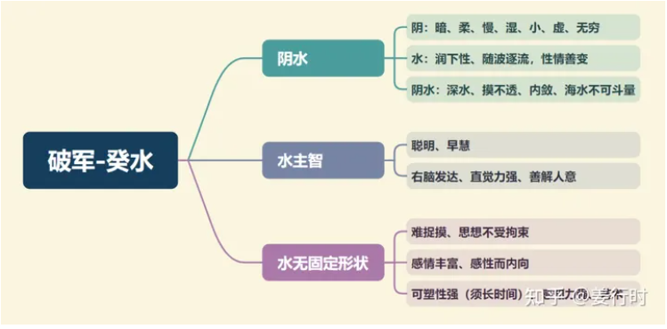

**最核心要点**

***1.癸水（阴水）***
1.前面已经介绍了不少属水的主星正曜：“阳水”——天同、天相，“阴水”——太阴、巨门、贪狼，其中破军与太阴两星看似对立、冲突（富有vs耗损），但却有其相似、关联性（母子、生育）。

太阴→阴水，化气为富，为财帛主、田宅主，母妻女星

破军→阴水，化气为耗，为夫妻、子女、奴仆主

2.破军属阴水，无固定形状，可为雨、水、溪，变化无常。破军的“耗（耗损）”除了可解读为战争的耗损之外（人祸），也可解读天灾所造成的损耗，例如：台风、地震、泥石流等。

***2.化气为耗***
1.破军的“耗”可以解读成“耗损、消耗、虚耗、耗时、耗费”等等，从古至今，耗损最大的事物就是天灾、人祸（战争），所以破军的“耗”，在古代容易让人退避三舍，但其实破军还有破坏而后建设，并在淘汰中换新的意思，可延伸为“喜改革传统、喜打破传统”。

陆斌兆前辈曾说过，“破军是军队中的敢死队、先锋队，冲锋陷阵，以争夺破坏为目的，但自身危险性也很大，损兵折将，在所不免，且孤军深入，有粮草接济不足之忧。若是破军化禄，则是后队补充接济源源不绝，名之为有根”。

2.破军有“武将”特性，它不像七杀内敛、冷静，破军比较偏向“暴动、冲动”，破军不喜约束、好强好胜、服从性低、原则性低。

3.破军喜化禄或见禄存，除了陆斌兆前辈所讲的“有根”之外，禄存既为“财星”还有”保守、讲原则“的特性，我们可以说“将星”看在“粮草”的份上，听从皇令。

4.破军主耗，有“消耗、虚耗”之意，因此不喜再遇“破耗星”（大耗小耗、地空地劫、破碎），若破耗星齐聚破坏力更大，主感情（婚姻）或钱财容易飘荡、破碎。

5.破军也不喜见“动星”，容易增加破军的“动荡性”，尤其是天马。破军本身已有波动性，又见天马（主活动面、活动力、流行星），就容易使破军更加波动或离乡更远。

6.破军坐命到底是耗财还是耗神？需要留意福德宫的吉凶，破军有“冲、攻”的将星特性，而福德宫天府却是保守、稳重的星曜，福德宫又主人的精神、思想、品性。若天府见煞曜、动星，则会影响破军的安逸、稳定，若天府见稳定星曜，则可使破军稍趋稳定。

***3.司祸福***
破军与贪狼星均有主“祸福”的特性，贪狼的祸福多为“桃花与欲望”性质，而破军的祸福多与“耗损与家庭”有关。

破军的“祸福”，除了坐命时需观察福德宫天府的吉凶之外，其次是需要留意破军三合的将星星曜——七杀、贪狼。除了此三星是否庙旺之外，此三星还喜见稳定星曜，且七杀、破军、贪狼三星，不论是何星坐落命宫，当大运顺转或逆转至另一颗星曜时，主环境上有大波动。

***4.为夫妻、子女、奴仆主***
破军星掌管人一生的“夫妻情缘、子女情缘、交友情缘”，也可以说，破军坐命之人，其价值观会以此三者为重。但在古代的传统文化中，男命和女命有些不同。

男命破军坐命，一般容易以朋友为先、孩子次之、妻子更次之；女命破军坐命，则是容易以小孩优先、丈夫次之、朋友更次之。当然，这只是通则而已，实际则须配合所会照的星曜来断。

破军掌管家庭责任，不论在命盘上坐落何宫，都会对命造的“家庭责任”有所影响，尤其以坐命宫、夫妻宫、子女宫最为明显与重要。

**破军星入十二宫**
破军不化忌，但若与文曲同宫，己年会随文曲化忌

***命宫***
破军入命宫之人，性情刚烈，个性豪迈，为朋友两肋插刀，幼时顽皮好动、活动力强。逢吉→生活民主、自由发展；逢煞→易体弱多病，叛逆。

化禄：主变动，乐观大方，肯拼肯花（钱）
化权：主开创，有主见，能力得以发挥

***兄弟宫***
兄弟缘薄，各自为政；长兄（姐）易见事端。逢吉→兄弟独立有成就或为军、警；逢煞→各怀心思，互不相容。

化禄：兄弟话多，在社会上能与兄弟朋友相互照应
化权：兄弟有主见，会发号施令

***夫妻宫***
喜聪明、有家庭责任感的配偶，另主双方喜驾驭（约束）对方。逢吉→宜晚婚，婚前宜同居；逢煞→易有畸恋或离异，或配偶灾多重病。

化禄：恋情精彩，晚婚为宜
化权：主配偶为事业奔波操劳

***子女宫***
耗星→先损后成，头胎易有损（早产或小产）。逢吉→子女活泼、顽皮，创意多，好交友，独立；逢煞→体弱或状况多，刚烈易顶撞，好动。

化禄：子女过于外向；行运逢之，小心桃花劫
化权：子女对家有助，坐子午宫主子女将来很有成就

***财帛宫***
来则易去，有钱必花，钱易损，财不聚，比较守不住；逢吉→财耗的小，易花在朋友、配偶或子女身上；逢煞→辛劳得财，流出快，易喜投机或借贷度日。

化禄：乃意外之财，暴发之财，破军横发横破，化禄也比较容易借到巨款
化权：主晚得财，先去后来，先破后得。

***疾厄宫***
先天体弱，后天灾多；主膀胱、肾、性器官疾病。

化禄：喜享受奢靡，注意花钱需节制
化权：为工作操烦，注意情绪容易暴躁

***迁移宫***
主奔波，在四马地（寅申巳亥四宫）更严重，出外辛苦、劳碌；逢吉→辛劳有成；逢煞→耗财又辛劳。

化禄：有人缘，交友满天下
化权：主驿马，奔波；尤其入寅申巳亥更强烈

***交友宫***
朋友大多是有实际力量的人；逢吉→部属能力强或多军警之友；逢煞→部属状况多易受拖累，宜结交军警或宗教之友。

化禄：有人缘，朋友之助力大
化权：在朋友中有机会掌权

***官禄宫***
工作不稳定，变化起伏大，易先损后成；可从事运动、舞蹈、武警、武职、重工业、土木工程，喜见左右及禄星→成就大。

化禄：在竞争激烈的事业环境下更容易胜出
化权：事业变动大，权力一把抓，需注意要能授权，才不会过分劳累奔波

***田宅宫***
耗星→先损后成；逢吉（庙旺）→稍有祖业；逢煞（陷位）→破耗祖业，或因受拖累或欺骗而变卖家产。

化禄：主容易冲动购买大房子，需注意是否有足够的预算和资金
化权：主会想装修自己的房子

***福德宫***
闲不住，心里较难平静安宁；逢吉→劳而有获，家庭美满（尤其夫妻、子女宫吉）；逢煞→劳心劳力，优柔寡断，常因财物、配偶子女烦心。

化禄：主好享受，喜高消费生活
化权：主喜欢奢靡享受

***父母宫***
父母个性刚强，好客，喜掌权；逢吉→父母白手起家，与父母互动尚可、缘薄；逢煞→父母辛劳或多灾病，另主上司运差。

化禄：主父母比较自我
化权：主幼儿期得父母照顾，父母也很强势

**破军星组合变化(入命)**

***破军独坐子午宫：对宫廉贞天相、三合七杀及贪狼***
***廉贞破军卯酉宫：对宫天相、三合武曲贪狼及紫微七杀***
破军在子午宫为庙旺之位，若能与禄存化禄、左辅右弼、天魁天钺相会，为“英星入庙格”——主能掌权（尤其武职大利）、辛劳有成、能攻能守。古文说，“破军子午宫无杀，官资清显至三公”。

卯酉宫与廉贞同度，又加上对宫天相落陷，因此增加情感上或精神上的动荡或压力，此组合武职（军警、医疗、手工艺品）为宜，更适合在公职或大企业任职（田宅宫为“机月同梁格”），反可减少动荡性质。

子午卯酉四宫，因有廉贞星与天相星的会照，最不喜火铃星、擎羊陀罗、化忌同度，主人感情或精神“耗损”，易有想不开或意外事故发生。

廉贞天相坐命的人，为人心地善良，智慧高，聪明多才，喜掌权，有领导能力，处事谨慎保守，人生价值观偏重于明哲保身。

***破军紫微丑未宫：对宫天相、三合廉贞贪狼及武曲七杀***
***破军独坐辰戌宫：对宫紫微天相、三合贪狼及七杀***
破军星坐守辰戌两宫，对宫为紫微天相，喜见左辅右弼同度，或天魁天钺相夹，主掌权或有贵人相助，若对宫的紫微天相逢吉星，一般主宜离乡发展，可遇贵人提携（尤其父母宫吉）；若紫微天相见煞星，则易影响破军星的稳定性，易产生动荡或叛变。若破军辰戌煞星集聚，坐守疾厄宫，防有重打击或重症。

古文说，“紫破命临于辰戌丑未，再加吉曜，富贵堪期”。紫微因与破军同宫增加了冲动和波折现象，同时也增加了拼搏精神，紫微破军会带领一群人向前冲。三合武曲七杀及廉贞贪狼，这三合的四颗星中多属落陷，增加了紫微破军的辛劳，唯有对宫天相遇吉可稍让其安定或减少波动。

紫破组合坐命为人霸气，独来独往，不喜受人管束，社交手腕高，说话做事都很大胆，敢爱敢恨，勇往直前，不怕得罪人。他们不按牌理出牌，喜欢改革传统。

***破军独坐寅申宫：对宫武曲天相、三合贪狼及七杀***
***破军武曲巳亥宫：对宫天相、三合紫微贪狼及廉贞七杀***
破军独坐寅申宫，一般力量以“地利”为主，唯中州派以“落陷”之位来论。古书说破军居卯宫（寅宫则无），逢吉星聚，主可贵，但“大江东去，一去不复返”，有“来的快，去的快”之意，需防突升突降的现象发生。

武曲破军组合坐命个性刚强，易冲动，喜掌权，成败起伏大，有孤注一掷而不计后果的冒险精神。

古书对破军星评价不高，所以古文云，“与破军同度，破祖丧家，而终身劳碌”，现今社会，武曲破军虽为动荡组合，却也仅仅表现在常常走动，聚少离多，不会像古文说的那么严重，武曲破军如果有见禄星（禄存、化禄）仍是很不错的组合。

武曲为财，破军为耗，因此武曲破军组合可能会有耗财、财损的现象，此时需加看太阴天机（寅申宫）之吉凶再来判断。