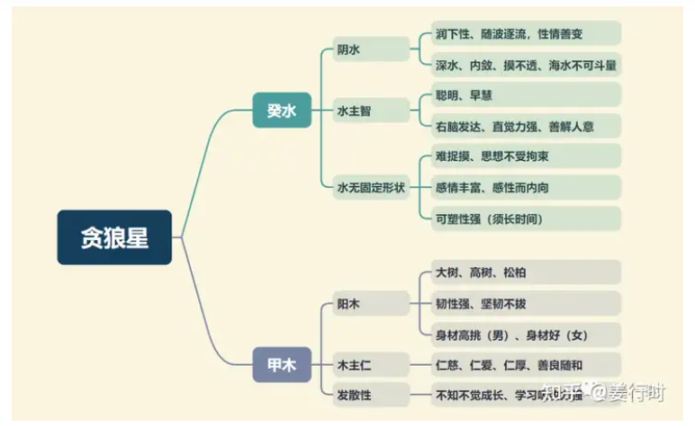

**最核心要点**

***1.癸水甲木***
贪狼星是癸水甲木双五行，阴水阳木，初期为水，后生为木，所以有两种说法：一则说幼年为水，壮年为木；另一说则为先天为水（内在为水），后天为木（外显为木），无论何种说法，“水生木”是确定的。若三合（三方）水星过旺或贪狼入亥子宫，则贪狼的水属性增强，因此古文说，“贪遇羊陀居亥子，名为泛水桃花”。

1.水星的聪明与智慧是有不同之处的，聪明主学习快、反应快，但不一定有智慧，需要将知识落实于生活以及人际关系中，以期达到某种结果，这样才算有智慧。这个过程就需要一些“技巧、手段”，所以贪狼星喜欢化权，因为化权有“权力、权谋”的特性，可使贪狼星化聪明为大智慧。

2.木有“不知不觉中成长"的象，所以天机（乙木）、贪狼坐命之人，最忌没有适时更新，若固守旧习，反易成为“朽木”；又或者水星过旺，则易为腐木或浮木。

3.木有向光性，尤其是阴木（天机），所以天机最喜逢太阳庙旺的行运，甲木的贪狼则是小时候喜欢，因为成长阶段喜父母的疼爱。

***2.化气为桃花***
1.贪狼星是斗数正曜中的大桃花星，廉贞为次桃花星，但桃花并非一定是桃色之事，也与“花卉、才华、才艺、人际”有关。
“花卉”可以让我们联想到园艺、农活、花朵、插花以及喜欢美的事物，所以贪狼星有设计、创意的特性。“才华、才艺”则分为“重精神”与“重欲望”两种，见煞星又见桃花星齐会，为重欲望的组合。

2.当贪狼同度、会照的土星、木星很多的时候，一般主有制化（五行生克）；或者科甲星多见（尤其是成对出现），因为科甲星一般都有“要求”的特性，尤其是遇到三台八座、龙池凤阁，此二种情况对欲望有“自制力、约束力”，为“重精神”的组合。

3.桃花星有时也主执着于某个嗜好，最严重的情形为“玩物丧志”。

4.古文说贪狼星“喜见空亡，反主端正”，此处所说的空亡一般是指地空为主，其次是截空、旬空，地劫不是；再次，此处是说贪狼若见空星，可使“桃花性质”下降，并非消失，大家要注意。
“桃花性质”多指情欲、物欲、表面（美的事物），当见空星时，其欲望降低，若又见宗教星（天刑、华盖），更主易接触宗教、玄学、灵性等事物。

5.贪狼星坐命的人，其人际关系一般不错，能言善道，能快速的与众人打成一片，不过它的特质大多仅是表面功夫，不见得易与人深交，因此贪狼的缺点即有“表面”“敷衍”的意味。

***3.司福祸主***
贪狼虽然不是任何宫位的星主，但其掌管祸福的现象或结果

贪狼星为桃花星，是一颗欲望的星曜，其属木，有善的特质，所以如果组合为善者则为福（例如逢空星或天刑）；若组合为恶者则为祸（例如见羊陀或昌曲化忌）。当然，善与恶仅为一念之间，因此贪狼星若有宗教信仰为佳，也可以增福，降低恶祸之事。贪狼星对神秘、玄学、五术有兴趣，天机也是，两星五行均主木。

贪狼星为福祸主，但在命盘十二宫里却无福祸宫，只有福德宫，而福德宫的福德主为天同星，所以天同与贪狼暗合（六合）。

**贪狼星入十二宫**

***命宫***
人际关系好，有异性缘，重享受（物质），才艺多，喜欢热闹浮华的环境。

化禄：桃花旺，又主聪明，有偏财运，可能会过于投机
化权：能干、有作为，有辩才，可掌权
化忌：贪狼化忌反而无桃花，可能空想不切实际；贪狼化忌喜玄学，适合研究命理五术

***兄弟宫***
逢吉→兄友才艺多；逢煞→兄友易不务正业或酒肉之友多。

化禄：主兄弟圆滑，社交能力强，欲望高
化权：主兄弟固执霸道，有主见
化忌：主兄弟固执，感情多波折（桃花不多）；可研习五术达精通

***夫妻宫***
喜配偶俊美，公关能力强，才艺多，有情趣，不宜早婚；逢煞→易离异或配偶外遇

化禄：配偶及本人都有异性缘
化权：配偶有主见，恋爱时配偶较主动；也主恋爱对象是自己选择的，别人无法干涉
化忌：有可能桃花是非多

***子女宫***
子女活泼、聪明、人缘好。逢吉→主有才艺；逢煞→宜注重子女幼年教育，培养琴棋书画等重精神的兴趣爱好。

化禄：子女人缘好，有才艺
化权：对子女教养态度过于强势，需注意子女反弹
化忌：子女易因感情烦恼；本人宜防桃花事

***财帛宫***
贪狼入财帛主投机、娱乐、教化、才艺。贪狼星入财帛宫，工作欲强，不过这种工作欲不是热爱工作本身，而是获得钱财的一种手段，会想拼、赚钱，爱财。

化禄：主能赚钱，但需交际应酬才能赚到钱，主偏财
化权：主创业，交际手腕好，可得横财，男忌沉溺女色
化忌：主爱财，但宜防桃花损财

***疾厄宫***
贪狼属阳木、阴水，主肝胆、肾脏、结石、桃色病、内分泌。

化禄：主桃花，重情欲
化权：喜欢往外跑，易外伤
化忌：注意肝功能、肾脏，以及桃色病

***迁移宫***
在外异性缘好，可适应繁忙奔波生活；喜欢寻找发财的机会，为金钱劳碌。逢吉→喜休闲娱乐，心情愉快；逢煞→酒色是非或车关。

化禄：主出外得异性之助，且异性缘佳；过于慷慨好客，应注意量入为出
化权：主异性缘，好动有冲劲，防沉溺酒色
化忌：出外防酒色损财，或桃色纠纷

***交友宫***
交游广阔，易交到酒肉朋友，不一定能交到真正知心的朋友。逢吉→稍有助力；逢煞→酒肉之友，也主部属流动性大，多变动。

化禄：慷慨好客，重朋友薄家人
化权：主桃花，也指酒肉朋友
化忌：与朋友容易有桃花纠葛，易对朋友太好

***官禄宫***
变动多，宜娱乐业、旅游业、教师、设计师、美容等行业，逢吉→才艺多，聪明；逢煞→易辍学或误入歧途

化禄：主偏财，喜投机
化权：主掌暗权，或创业，事业心重
化忌：事业可靠桃花赚钱，上班族小心办公室恋情

***田宅宫***
主住的地方比较热闹，易在学区、商业区或公园附近；无祖业或早年田产少。逢吉→尚有产业；逢煞→需防因酒色赌而败家业

化禄：喜购买豪华不动产，但需量力，限运逢之，有桃花
化权：表喜欢将房子布置得很华丽
化忌：主易有已婚桃花纠纷

***福德宫***
完美主义者，好胜心强，欲望多，有口福，重美食或美服。

化禄：主长寿，身体健康，各类欲望皆有
化权：主观意识强，欲望强
化忌：易花钱，宜防破财

***父母宫***
父母人际关系佳，有才（厨）艺，逢吉→得福，父母、上司运佳；逢煞→得祸，父母、上司运差，另主父母感情不佳。

化禄：父亲高寿，社交能力强
化权：父亲社交能力强，主观意识也强
化忌：父亲固执，注意桃花事

**贪狼星喜忌**
1.贪狼不喜与七杀或破军分守身命宫，这两种组合需要以见煞星（羊陀、化忌）及桃花星同度才算（对宫或三方会照为次），主此人易玩物丧志，或好酒色财气（吃喝嫖赌），为人个性易情绪化，不满现状，工作事业易常常变换，婚姻起起伏伏。
改善方法有二：一是从幼年时找出（培养）良性嗜好，以及增强其注意力；二是从星曜组合特质找出适合的行业来发展，或其工作性质具有变动特质也可以。

2..前文已述，贪狼星喜逢空星或天刑，贪狼星还喜欢火星铃星同度或相逢，主“突发”，古文说，“贪铃并守，将相之名”,"贪狼火星居庙旺，名镇诸邦"，古时是武职大利，现今社会还适宜从商经商，但以见财星为佳，尤武曲同度或会照，又见禄存、化禄，主其“突发”的财源较大或期间较长久，此处要注意，贪狼须居庙旺位。

3.不喜昌曲，尤其是昌曲化忌，古文说，“昌曲同度，必多虚而少实”。

**贪狼星组合变化(入命)**

***贪狼独坐子午宫：对宫紫微、三合七杀及破军***
***紫微贪狼卯酉宫：对宫空宫、三合廉贞七杀及武曲破军***
子午宫的贪狼独坐，贪狼特质明显，以格局来说，有居子的“泛水桃花格”，居午的“马头带箭格”。

1.泛水桃花格
“贪遇羊陀居亥子，名为泛水桃花”，大多主人聪明，易激进，欲望重，易因色惹祸。命宫贪狼居子与擎羊落陷同度，福德宫（寅宫）为天相武曲化忌，会照夫妻宫（戌）的天府廉贞陀罗及迁移宫（午）的紫微化权。
所以命宫擎羊的激进与福德宫武曲化忌，紫微化权及陀罗有关，主其思想容易过于执着或主观极重，或性喜投机。此格一般多主迷恋花酒，性喜投机或赌博（物质欲望）；若再遇文昌文曲、桃花星来会照，则易有情感是非或外遇之事发生。

2.马头带剑格
“马头带剑，威震边疆”，“马头带剑，非夭折及主刑伤”，此处仅讲 "贪狼居午，戊年生人"的组合。
此格以贪狼化禄与擎羊同度为基本条件，多属武职大利。
“威震边疆”是指宜外出发展而有功名，因此贪狼的三方四正以多见吉星为佳，尤其是迁移宫紫微能见左辅右弼更佳，主“出外遇贵”。若三方四正吉星煞星参半，则主“非夭折即主刑伤”, 指富贵易不耐久，且亦有刑伤，或靠技术为生，奔波。
此格之人处事风格强悍，易单刀直入而不轻易妥协，所以适合在竞争激烈的环境中出人头地，不适合温文尔雅的环境。

3.卯酉宫贪狼与紫微同宫，较会圆融、变通、交际，重面子，其次三合武曲破军、廉贞七杀，这个组合比较动荡（因为七杀、破军、贪狼都是动荡的星曜）。
紫贪组合为人生活浪漫，喜欢娱乐享受，活泼而热心，有专业性技术或嗜好，理想多而不重实际，讨人喜欢，异性缘佳。

***武曲贪狼丑未宫：对宫空宫、三合紫微七杀及廉贞破军***
***贪狼辰戌宫：对宫武曲、三合七杀及破军***
1.武曲贪狼同居丑未宫时，因贪狼有交际应酬及圆滑的特性，可以让武曲的刚直变得稍微软化一些，三合紫微七杀及廉贞破军，属动荡、波动性组合，所以“横发”特性比较大，风险也比较高；辰戌宫贪狼独坐，三合七杀破军，杀破狼组合，也是属动荡波折。
（我们目前是单纯分析主星的组合，没有将副星考虑进来，所以有时动荡组合也会因副星同度或三合、对照而变得保守、谨慎。）

2.武贪组合有“武贪不发少年人”的说法，大多属晚发型，古人以“三十岁后”为发迹的界线，古时平均寿命不高，而现代因为平均寿命提高至七八十岁，所以“晚发"时间稍有延后，大多为45~55之间发迹。
当然，不是单纯主星结构就能论断一定晚发，仍需以见火星铃星及禄存或化禄为佳。

3.贪狼居这四宫，一般会比较“利己心重”，所以其人际关系多以“有利害关系”为交际应酬目的。
要注意，并非武贪居辰戌丑未的人一定先贫后富或者说小时候贫穷，反倒若是出生于富裕之家时，对其晚发的“助力”会有影响，因为少时富裕就会少磨练，较难以激发斗志。

***贪狼独坐寅申宫：对宫廉贞、三合破军及七杀***
***廉贞贪狼巳亥宫：对宫空宫、三合紫微破军及武曲七杀***
1.廉贞与贪狼星为对星，两星均有桃花特质，桃花本身有“好色”现象，然而“好色”的本质有两种意义：一则是重视物欲情欲感受，另一则是喜欢美丽（颜色）的事物，在现代社会可谓“视觉系”—— 颜色、线条、舞蹈、抽象美，因此这种组合勇于表现自己，不惧标新立异，可走艺术、美术、舞蹈、娱乐等发展路线。

2.廉贞化气为囚，逢煞（尤其羊陀）及桃花星时，“囚”的特质会比较明显，一般易有感情困扰或惹官司诉讼之事。另外此二星暗合之天同天梁也形成对宫或同度的组合，所以“福”与“荫”的吉凶会间接影响廉贞贪狼的祸福。

